# DeepFool：一种简单而精确的愚弄深度神经网络的方法

## 摘要

最先进的深度神经网络已经在许多图像分类任务中取得了显著的效果。然而，这些相同的架构已经被证明是不稳定的，对图像的小干扰、良好的搜索。尽管这一现象很重要，但还没有提出有效的方法来准确计算最先进的深度分类器对大规模数据集上的此类异常的影响。在本文中，我们填补了这一空白，并提出了DeepFool算法来有效地计算欺骗深层网络的扰动，从而可靠地量化这些分类器的鲁棒性。大量的实验结果表明，我们的方法在计算对抗性扰动和使分类器更健壮方面优于最近的方法。1.

## 1.简介

深度神经网络是一种功能强大的学习模型，在许多研究领域，如生物信息学[1,16]、语音[12,6]和计算机视觉[10,8]实现了最先进的模式识别性能。尽管深度神经网络在分类任务中表现出了非常好的性能，但最近的研究表明，它们对数据的对抗性扰动尤其不稳定[18]。事实上，对数据样本的微小且通常不易察觉的扰动足以愚弄最先进的分类器，并导致不正确的分类。（如图1）。正式地，对于给定的分类器，我们将敌对扰动定义为足以改变估计标签$\hat k(x)$的最小扰动r：

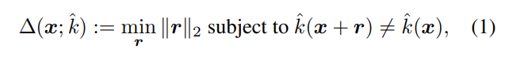

其中$x$是图片，$\hat k(x)$是被评估的标签。我们称$\Delta (x;\hat k)$为$\hat k$在点x的鲁棒性。然后将分类器$\hat k$的鲁棒性定义为

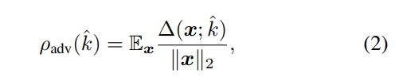

其中$\mathbb{E}_x$是对数据分布的期望。对抗性干扰的研究有助于我们理解分类器使用的特征。这些例子的存在似乎与学习算法的泛化能力相矛盾。虽然深度网络在图像分类任务中实现了最先进的性能，但它们对小规模的对抗性干扰完全不鲁棒，并且往往会错误分类视觉上看起来与干净样本相似的最小扰动数据。**尽管对抗攻击特定于分类器，但对抗性扰动似乎可以在不同的模型中推广**[18]。从安全角度来看，这实际上可能会成为一个真正的问题。

（评价：这种鲁棒性定义，现在看来比较原始了，现代定义见A general framework for defining and optimizing robustness）

因此，为了研究和比较不同分类器对对抗性干扰的鲁棒性，有必要找到一种精确的方法来发现对抗性干扰。这可能是更好地理解现有体系结构的局限性，以及设计提高健壮性的方法的关键。尽管最先进的分类器对对抗性不稳定性的脆弱性很重要，但还没有提出一种有充分依据的方法来计算对抗性扰动，我们在本文中填补了这一空白。

我们的主要贡献如下：

* 我们提出了一种简单而准确的方法，用于计算和比较不同分类对对抗性扰动的鲁棒性。
* 我们进行了广泛的实验比较，结果表明：1）我们的方法比现有方法更可靠、更有效地计算对抗性扰动；2）使用对抗性示例增加训练数据，显著提高了对一般扰动的鲁棒性
* 我们表明，使用不精确的方法来计算对抗性扰动可能会导致关于稳健性的不同且有时误导的结论。因此，我们的方法可以更好地理解这一有趣的现象及其影响因素。

我们现在回顾一些相关工作。在[18]中首次引入并研究了对抗性不稳定现象。作者通过求解惩罚优化问题来估计对抗性例子，并给出了一个分析，表明神经网络的高度复杂性可能是解释对抗性例子存在的原因。不幸的是，[18]中采用的优化方法非常耗时，因此无法扩展到大型数据集。在[14]中，作者通过对Pascal3D+注释的实验，证明了卷积网络对某种形式的转换并不是不变的。最近，Tsai等人[19]提供了一个软件，可以将给定的图像错误分类到指定的类别中，而不必找到最小的扰动。Nguyen等人[13]生成了合成的无法识别的图像，这些图像被高度可靠地分类

[3]的作者还研究了一个相关的问题，即找到愚弄图像分类器的最小**几何变换**，并提供了分类器对几何变换鲁棒性的定量度量。[4]的作者介绍了“快速梯度符号”方法，该方法可以非常有效地计算给定分类器的对抗性扰动。尽管这种方法很有效，但它只提供了最优扰动向量的粗略近似值。事实上，它执行一个独特的梯度步骤，这通常会导致次优解。然后，为了构建更鲁棒的分类器来应对对抗性干扰，[5]在训练过程中引入了平滑度惩罚，以提高分类器的鲁棒性。值得注意的是，应用[18]中的方法是为了产生对抗性干扰。最后，我们应该提到的是，敌对不稳定现象也导致了[2]中的理论工作，研究了一些分类器家族的敌对干扰问题，并提供了这些分类器鲁棒性的上界。然而，需要对更复杂的分类器的对抗性不稳定性现象有更深入的理解；为了更好地理解这一现象，本文提出的方法可以被视为有效、准确地产生对抗性干扰的基线

论文的其余部分组织如下。在第2节中，我们介绍了一种在二元分类器中查找对抗性扰动的有效算法。第3节提供了多类问题的扩展。在第4节中，我们提出了大量实验，证实了我们的方法的准确性，并概述了它在构建更健壮的分类器方面的优势。

## 2.二元分类器的设计

由于多类分类器可以看作是二元分类器的集合，我们首先提出了二元分类器的算法。也就是说，我们在这里假设$\hat k(x)=\text{sign}(f(x))$，其中f是任意标量值图像分类函数$f:\R^n\to \R$。我们也用$\mathcal{F} \stackrel{\Delta}=\{x:f(x)=0\}$表示，f为零的水平集。我们首先分析了f是仿射分类器f(x)=wT x+b的情况，然后导出了可应用于任何可微二元分类器F的一般算法。

---

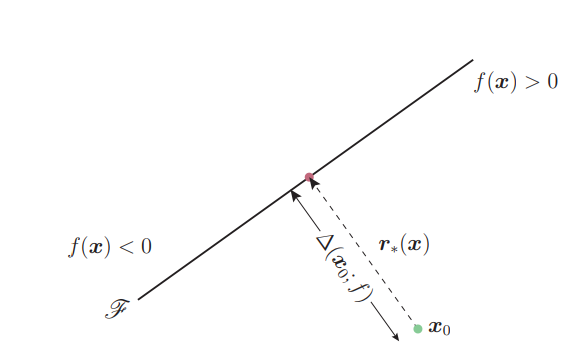

图2：线性二进制分类器的对抗性示例。

---

在分类器f是仿射的情况下，很容易看出f在点x0的鲁棒性，$\Delta(x_0;f)^2$等于$x_0$到仿射超平面的距离。改变分类器决策的最小扰动对应于x0到F的正交投影。它由闭式公式给出：

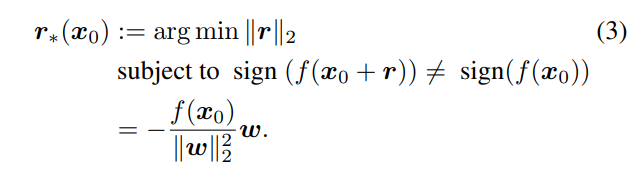

（$\frac{w}{||w||_2}$实际上是可以看作是梯度的方向向量（注意梯度指向上升的方向），$\frac{f(x_0)}{||w||_2}$则是$x_0$到分类面的有向距离）

假设f是一个一般的二元分类器，我们采用迭代方法来估计鲁棒性∆（x0；f）。具体地说，在每次迭代中，f在当前点$x_i$周围线性化，并且线性化分类器的最小扰动被计算为

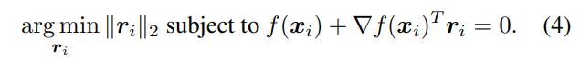

使用等式（3）中的闭式解计算算法迭代i处的扰动ri，并更新下一次迭代xi+1

（注意这个Gradient符号，可以看出实际上含义是将分类器当作线性映射时，得到的w）

当xi+1改变分类器的符号时，算法停止。算法1总结了用于二进制分类器的DeepFool算法，图3显示了该方法的地理度量说明

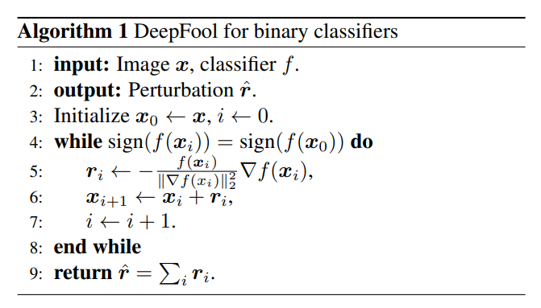

在实践中，上述算法通常可以收敛到零水平集F上的一点。为了到达分类边界的另一侧，最终扰动向量rˆ乘以常数1+η，$\eta<< 1$。在我们的实验中，我们使用η=0.02

---

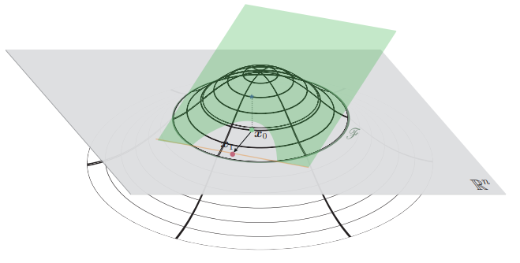

图3，算法1中n=2的可视化，假设$x_0\in \R^n$，绿色平面是$x\to f(x)+\nabla f(x_0)^T(x-x_0)$，它与分类器函数$x\to f(x)$相切（线框图），橙色线表示$f(x)+\nabla f(x_0)^T(x-x_0)=0$，x1是通过将x0投影到Rn的橙色超平面上，从x0得到的。这里灰色平面表示0值平面

---

## 3. 用于多分类器的Deepfool

现在我们将DeepFool方法扩展到多类情况。多类分类筛选最常用的方案是“one-vs-all”。因此我们同样也基于这个模式提出算法。在这个方案中，分类器有c个输出，其中c是类的数量。因此分类器可以定义为$f:\R^n\to \R^c$，分类是通过以下映射完成的

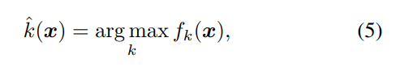

其中fk（x）是对应于第k类的f（x）的输出。与二进制情况类似，我们首先针对线性情况提出了建议的方法，然后将其推广到其他分类器。

### 3.1. 仿射多类分类器

设f（x）为仿射分类器：$f(x)=W^Tx+b$，由于$\hat k$是one vs all分类方案的结果，因此欺骗分类器的最小扰动可以重写如下

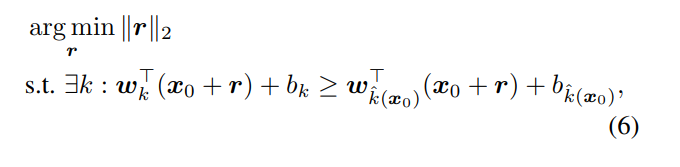

---

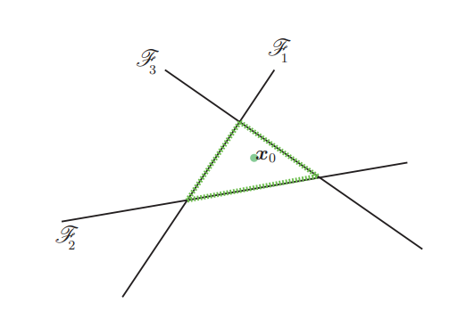

图4：对于属于类4的x0，设Fk={x:Fk（x）− f4（x）=0}。这些超平面用实线表示，P的边界用绿色虚线表示

---

其中wk是W的第k列。几何上，上述问题对应于计算x0和凸多面体P的补之间的距离

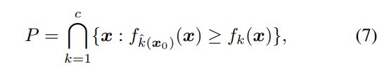

其中x0位于P内，我们用$\text{dist}(x_0,P^c)$表示这个距离

多面体P定义了$f$输出标签$\hat k(x_0)$的空间区域。该设置如图4所示。式（6）中问题的解可以用封闭形式计算，如下所示。定义$\hat l(x_0)$为靠近P边界的最近超平面。形式上，$\hat l(x_0)$可以计算如下

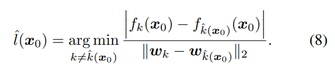

（理解起来很容易，到达边界肯定是让两个f的差为0嘛，然后消耗的就是x0处两个f的差，我们不妨将$f_k(x)-f_{\hat{k}}(x)$合并项成一个线性函数，自然容易得解）

最小扰动$r_*(x_0)$是将x0投影到$\hat l(x_0)$对应超平面上的向量，即

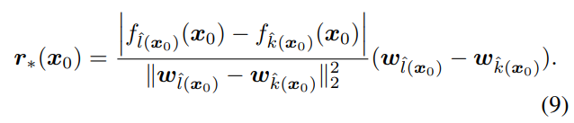

换句话说，我们找到了x0在P的面上最接近的投影

### 3.2. 通用分类器

现在我们将DeepFool算法扩展到多类可微分类器的一般情况。对于一般非线性分类器，等式（7）中描述分类器输出标签$\hat l(x_0)$的空间区域的集合P不再是多面体.

按照在二元情况下解释的迭代线性化过程，我们在迭代i处用多面体$\bar P_i$来近似集合P

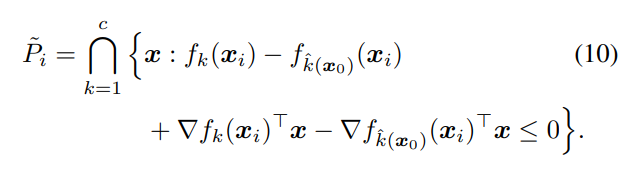

---

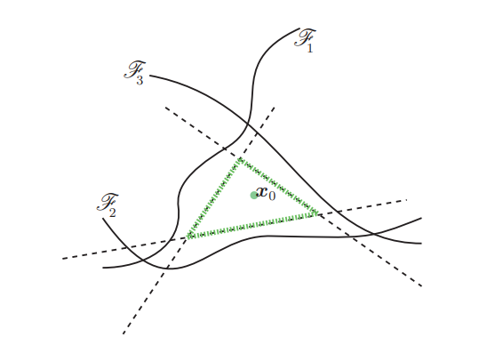

图5. 对于$x_0$属于第四类，让$\mathcal{F}_k=\{x:f_k(x)-f_4(x)=0\}$，线性化的零水平集用虚线表示，多面体的边界用绿色表示

---

然后，在迭代I中，用$\text{dist}(x_i,\bar P_i^c)$近似Xi和P的补之间的距离$\text{dist}(x_i, P^c)$

具体地说，在算法的每次迭代中，计算到达多面体$\bar P_i^c$边界的扰动向量，并更新当前估计。算法2中给出了该方法。需要注意的是，该算法以贪婪的方式运行，不能保证收敛到（1）中的最优扰动。然而，我们在实践中观察到，我们的算法产生非常小的扰动，这被认为是最小扰动的良好近似

应该注意的是，Deep Fool的优化策略与现有的优化技术密切相关。在二进制情况下，它可以被视为牛顿迭代算法，用于在欠定情况下寻找非线性方程组的根[15]。这种算法被称为正常流方法。这种优化技术的收敛性分析可以在[21]中找到。我们在二进制情况下的算法也可以被视为梯度下降算法，具有自适应步长，在每次迭代时自动选择。算法2中的线性化也类似于序列凸规划，其中约束在每一步都被线性化

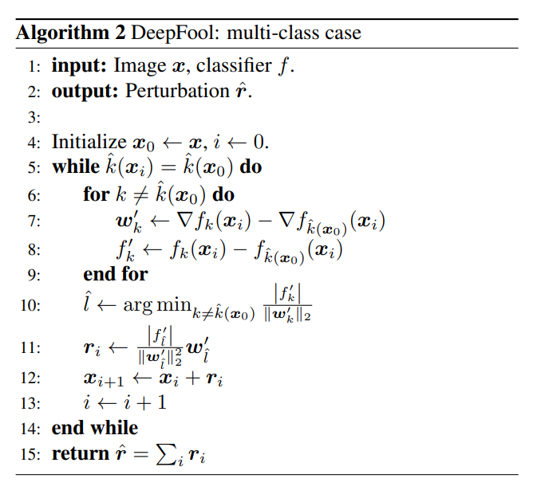

### 3.3. 到p范数的推广

在本文中，我们用$l_2$范数测量了扰动。

然而，我们的框架并不局限于这种选择，所提出的算法可以简单地适应于寻找任何p范数（p∈ [1, ∞)). 为此，算法2中第10行和第11行中的更新步骤必须分别替换为以下更新

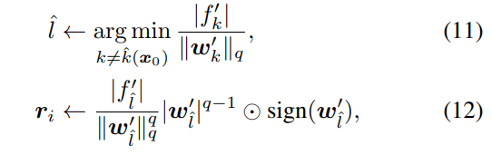

其中是$\odot$是逐点积，$q=\frac{p}{p-1}$，特别地，当p=∞ （即上确界范数）`∞), 这些更新步骤为

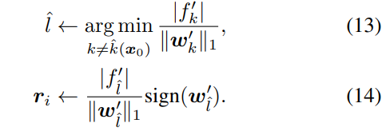

（我的天，给个公式不给出处的吗，拉格朗日乘数法推了半天还是因为讨论符号问题没能准确推出，这里直接给个找了半天找到的证明——An Analytical Solution to the Minimum Lp-Norm of a Hyperplane (sciencedirectassets.com)）

## 4. 实验结果

### 4.1. 准备工作

现在，我们在应用于MNIST、CIFAR-10和ImageNet图像分类数据集的深度卷积神经网络体系结构上测试我们的DeepFool算法。我们考虑以下的深度神经网络结构：

* MNIST：两层全连接网络和两层LeNet卷积神经网络架构[9]。这两个网络都由SGD使用MatConvNet[20]软件包进行培训。
* CIFAR-10：我们培训了三层LeNet 结构，以及网络中的网络（NIN）结构[11]。
* ILSVRC 2012：我们使用了CaffeNet[7]和GoogLeNet[17]预先培训的模型

为了评估分类器f对敌方攻击的鲁棒性，我们计算了平均鲁棒性$\hat\rho_{adv}(f)$，其定义如下：

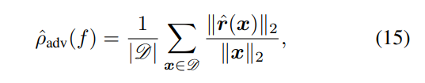

其中rˆ（x）是使用DeepFool获得的估计最小扰动，D表示测试集4。

我们将提出的DeepFool方法与计算对抗性扰动的最新技术进行了比较。[18]中的方法解决了一系列优化问题，以找到最小扰动，而[4]通过取梯度的符号来估计最小扰动

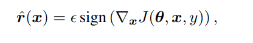

J是训练神经网络的代价，θ是模型参数，y是x的标号。这种方法称为快速梯度符号法。实际上，在没有选择参数$\epsilon$的一般规则的情况下，我们选择了最小的$\epsilon$，使得在扰动后90%的数据被错误分类。

### 4.2. 结果

我们在表1中报告了使用不同方法计算的每个分类器的精度和平均稳健性$\hat \rho_{adv}$。

我们还展示了每种方法计算一个对抗性样本所需的运行时间。可以看出，与使用竞争方法计算的扰动相比，Deep Fool估计的扰动更小（因此更接近（1）中定义的最小扰动）

例如，使用DeepFool获得的平均年龄扰动比使用[4]估算的平均年龄扰动低5倍。在ILSVRC2012 Challenge数据集上，平均扰动比快速梯度法小一个数量级。此外，还应注意，与[18]中的方法相比，所提出的方法还产生了更小的扰动向量。因此，所提出的方法在检测可能欺骗神经网络工作的方向时更准确。因此，DeepFool可以作为一个有价值的工具来准确评估分类器的鲁棒性

---

表1：不同分类器在不同数据集上的对抗鲁棒性。时间列中给出了每种方法计算一个样本所需的时间。这些时间是在没有CUDA支持的2015年年中MacBook Pro上计算的。星号标记确定使用GTX 750 Ti GPU计算的值

---

在复杂性方面，提出的方法比[18]中提出的标准方法快得多。

事实上，虽然该方法[18]涉及一系列目标函数的代价高昂的最小化，但我们从经验上观察到，DeepFool会在几次迭代（即小于3次）中收敛到一个干扰向量，从而愚弄分类器。因此，与最先进的方法相比，该方法可以获得更精确的扰动向量，同时具有更高的计算效率。这使得它很容易被用作基线方法，以估计大规模数据集上非常深入的神经网络的鲁棒性。在此背景下，我们首次对大规模ImageNet数据集上最先进的分类器的稳健性进行了定量评估。可以看出，尽管这些方法具有很好的测试精度，但它们对一般扰动极不稳定：比原始图像小1000量级的扰动足以愚弄最先进的深层神经网络。

我们在图1中展示了由快速梯度符号和深度傻瓜生成的扰动图像。可以观察到，所提出的方法会产生几乎无法感知的对抗性扰动，而快速梯度符号方法会输出更高范数的扰动图像

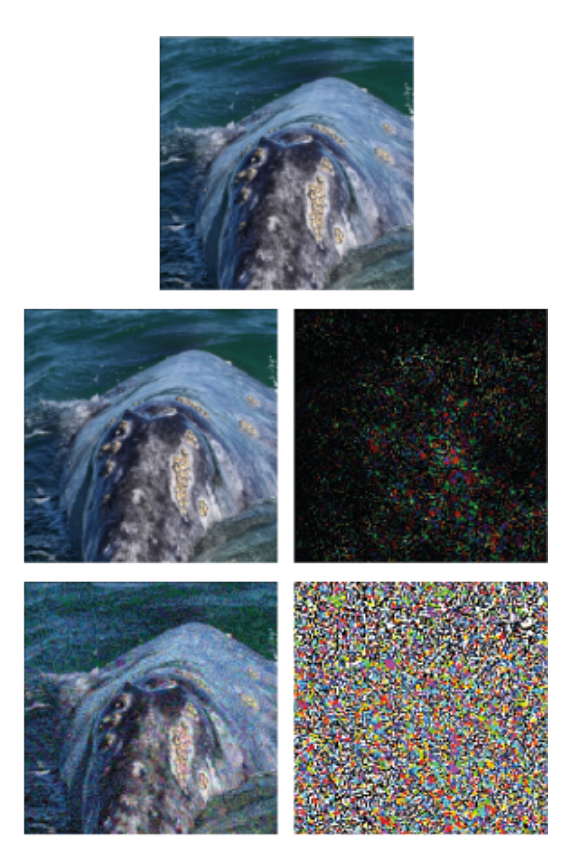

---

应该注意的是，当使用无穷范数时，上述结论没有改变：与计算对抗性示例的其他方法相比，DeepFool产生的对抗性扰动更小（因此更接近最优值）

表2报告了无穷范数平均鲁棒性。其中rˆ（x）分别使用DeepFool（p=∞, 参见第3.3节)，以及MNIST和CIFAR-10任务的快速梯度符号方法。

---

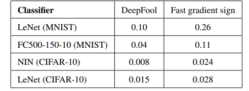

表2：$\hat\rho^\infty_{\text{adv}}$基于DeepFool（最小l）的四个不同网络的adv∞ 扰动）和快速梯度符号法，错误分类率为90%。

---

微调使用对抗性示例

在本节中，我们微调表1中关于对抗性示例的网络，为MNIST和CIFAR-10任务构建更健壮的分类器。具体来说，对于每个网络，我们进行了两个实验：（i）在DeepFool的对抗性示例上微调网络，（ii）在快速梯度符号对抗性示例上微调网络。我们通过额外执行5个阶段来微调网络，仅在受干扰的训练集上，学习率降低50%。对于每个实验，在所有5个额外的时期使用相同的训练数据。为了完整性，我们还对原始数据进行了5次额外的记录。不同微调策略下ρˆadv的演变如图6a至6d所示，其中稳健性ρˆadv是使用DeepFool估计的，因为这是最精确的方法，如表1所示。

观察到，使用DeepFool对抗性示例进行微调显著提高了网络对对抗性扰动的鲁棒性，即使在额外的一个历元之后。例如，MNIST上网络的活跃度提高了50%，NIN的健壮性提高了约40%。另一方面，非常令人惊讶的是，[4]中的方法会导致对网络对抗性扰动的鲁棒性降低。我们假设这种行为是由于使用快速梯度符号法估计的扰动比最小对抗性扰动大得多。**对带有过度扰动图像的网络进行微调会降低网络对敌对扰动的鲁棒性**。为了验证这一假设，我们在图7中比较了一个网络的对抗鲁棒性，该网络与使用DeepFool获得的对抗性示例进行了微调，其中扰动的范数故意乘以α=1,2,3。有趣的是，我们看到，通过放大对抗性扰动的范数，微调网络的鲁棒性降低。这或许可以解释为什么过度扰动的图像会降低MNIST网络的鲁棒性：这些扰动可能会重新改变数字的类别，因此基于这些示例的微调可能会导致鲁棒性下降（如图8所示）。这证明了我们的假设，并进一步说明了设计精确方法来计算最小扰动的重要性

(唔，这个观点，有些奇怪哦)

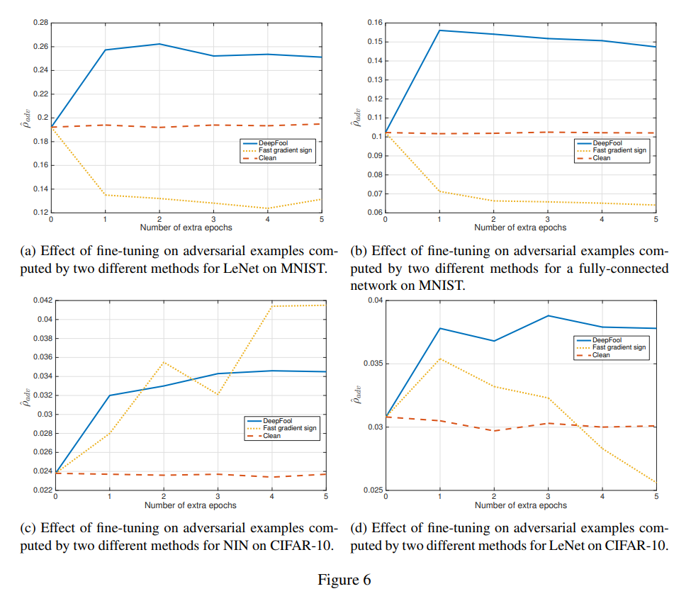

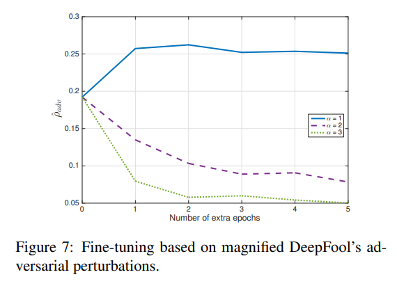

表3列出了微调网络的精度。可以看出，使用DeepFool进行微调可以提高网络的精度。相反，使用[4]中的方法进行微调会导致我们所有实验中的测试精度降低。这证实了一种解释，即快速梯度符号法输出过度扰动的图像，导致测试数据中不太可能出现图像。因此，它会降低该方法的性能，因为它充当不代表原始数据分布的正则化器。这种效应类似于几何数据增强方案，在这种方案中，原始样本的大变换对泛化具有反作用。

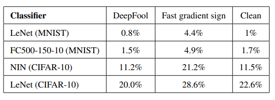

表3：对抗性示例微调后的网络测试误差（五个阶段后）。每个列对应不同类型的增强扰动。

为了强调正确估计最小扰动的重要性，我们现在表明，使用近似方法可能会导致关于网络对抗鲁棒性的错误结论。我们在快速梯度符号对抗性示例上微调NIN分类器。我们遵循前面描述的程序，但这一次，我们将学习率降低了90%。我们使用DeepFool和快速梯度符号方法评估了该网络在不同额外时期的通用稳健性。如图9所示，红色图夸大了训练对对抗性示例的影响。此外，它不够敏感，无法证明在第一个额外的历元时鲁棒性的损失。这些观察结果证实，使用准确的工具来衡量分类器的稳健性对于得出关于网络稳健性的结论至关重要

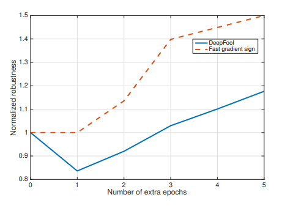

图9：如何通过不同的方法判断对手的稳健性。这些值由原始网络的相应ρˆadv标准化

## 5. 结论

在这项工作中，我们提出了一个名为DeepFool的算法来计算欺骗最先进的分类筛选器的对抗性示例。它基于分类器的迭代线性化，以产生足以改变分类标签的最小扰动。我们在三个数据集和八个分类器上提供了大量的实验证据，展示了所提出的方法在计算对抗性干扰方面优于最先进的方法，以及所提出方法的效率。

由于DeepFool算法能够准确估计对抗性干扰，因此它提供了一种高效、准确的方法来评估分类器的鲁棒性，并通过适当的微调来提高其性能。因此，所提出的方法可以作为一种可靠的工具来准确估计最小扰动向量，并构建更健壮的分类器。
