# 对抗环境下深度学习的局限性

## 摘要

深度学习利用大数据集和计算效率高的训练算法，在各种机器学习任务中都优于其他方法。然而，深层神经网络训练阶段的缺陷使其容易受到对手样本的攻击：对手精心设计的输入，目的是导致深层神经网络错误分类。在这项工作中，我们形式化了针对深度神经网络（DNN）的敌手空间，并在精确理解DNN输入和输出之间映射的基础上，引入了一类新的算法来制作敌手样本。在计算机视觉的应用中，我们证明了我们的算法能够可靠地生成按人类受试者正确分类的样本，但DNN在特定目标中错误分类，具有97%的对抗成功率，而每个样本仅修改平均4.02%的输入特征。然后，我们通过定义一个难度度量来评估不同样本类别对对抗性破坏的脆弱性。最后，我们描述了通过定义良性输入和目标分类之间距离的预测度量，概述对抗性样本防御的初步工作。

## 1. 简介

大型神经网络在21世纪中期被重新命名为深度神经网络（deep neural networks，DNN），在许多任务中表现优于其他方法，从而改变了机器学习领域的面貌。这是由于降低了训练的计算复杂性的进步[20]。例如，深度学习（Deep learning，DL）现在可以利用大型数据集实现比以前的分类技术更高的准确率。简而言之，DL正在许多领域改变复杂数据的计算处理，如视觉[24]、[37]、语音识别[15]、[32]、[33]、语言处理[13]、金融欺诈检测[23]和最近的恶意软件检测[14]。

深度学习的使用越来越多，这促使对手操纵DNN，迫使输入错误分类。例如，深度学习应用程序使用图像分类器来区分不适当的内容和适当的内容，使用文本和图像分类器来区分垃圾邮件和非垃圾邮件。一个能够制造误分类输入的对手将从逃避检测中获益——事实上，如今这种攻击发生在非DL分类系统上[6]、[7]、[22]。在物理领域，考虑使用DL来识别交通标志的无人驾驶汽车系统〔12〕。如果稍微改变“停止”标志会导致DNN错误分类，汽车将不会停止，从而破坏汽车的安全。

---

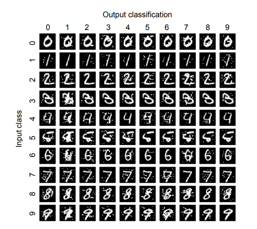

图1：对抗性样本生成——将失真添加到输入样本中，迫使DNN输出对抗性选定分类（最小失真=0.26%，最大失真=13.78%，平均失真ε=4.06%）。

---

对抗性样本是一种精心设计的输入，用于导致深度学习算法错误分类。请注意，对抗性样本是在测试时创建的，是在防守者训练DNN后创建的，不需要对训练过程进行任何更改。图1显示了从我们的验证实验中获取的对抗性样本示例。它展示了如何改变最初显示数字的图像，迫使DNN将其归类为另一个数字。对抗性样本是从良性样本中创建的，通过利用DNN从有限训练集[4]学习到的不完美泛化，以及用于构建DNN的大多数组件的潜在线性，添加扭曲[18]。之前的工作探索了DNN特性，这些特性可用于制作对抗性样本[18]、[30]、[36]。简单地说，这些技术利用了网络训练算法计算的梯度：不是像通常那样使用这些梯度来更新网络参数，而是使用梯度来更新原始输入本身，后者随后被DNN错误分类。

在本文中，我们描述了一类针对任何前馈（非循环）DNN[31]的对抗性样本创建算法，并就输出分类的完整性形式化了深度学习的威胁模型空间。与前面提到的方法不同，我们计算从输入到输出的直接映射，以实现明确的对抗目标。此外，我们的方法只改变了输入特征的一小部分（通常很小），从而减少了源输入的扰动。它还使对手能够应用启发式搜索来查找导致输入目标错误分类的干扰（干扰输入以产生特定的输出分类）。

更正式地说，DNN模拟了一个多维度函数$F:X\to Y$，其中X是特征向量，Y是输出向量。我们从$X$构造了一个对手样本$X^*$，通过添加扰动向量δX，解决以下优化问题：

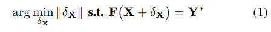

其中$X^*=X+\delta x$是对抗样本，$Y^*$是敌手希望的输出。$||\cdot||$代表范数解决这个问题是非常重要的，因为DNN的特性使其成为非线性和非凸的[25]。因此，我们通过构建从输入扰动到输出变化的映射来构建对抗性样本。注意，上面提到的所有研究都采用了相反的方法：它使用输出变化来寻找相应的输入扰动。我们对输入变化如何影响DNN输出的理解源于对**前向导数**的评估：我们引入并定义的矩阵是DNN学习的函数的**雅可比矩阵**。前向导数用于构造对抗性显著性图，指示要包含在扰动δX中的输入特征，以便生成对抗性样本，从DNN中诱导特定行为。

前向导数方法比之前系统中使用的梯度下降技术强大得多。它们适用于有监督和无监督的体系结构，允许对手为广泛的对手样本家族生成信息。事实上，对抗显著性图是基于前向导数的多功能工具，设计时考虑了对抗目标，在干扰选择方面给予对手更大的控制。在我们的工作中，我们考虑下面的问题来规范DL在对抗设置中的安全性：（1）“对DL进行攻击所需的最小知识是什么？”（2） “如何识别易受伤害或强抗性样本？”，（3）“人类如何感知对抗性样本？”

对抗性样本生成算法通过广泛研究的LeNet体系结构（用于手写数字识别的领先DNN[26]）和MNIST数据集[27]进行验证。我们证明，任何输入样本都可能被误分类为任何目标类，成功率为97.10%，而每个样本的输入特征平均被误分类为4.02%。样本生成的计算成本适中；在我们的设置中，每个样本都在不到一秒钟的时间内生成。最后，我们研究了算法参数对失真和人类对样本感知的影响。本文的贡献如下：

* 我们根据对手的目标和能力，形式化了对手对分类DNN的空间。在这里，我们可以更好地理解攻击者的能力如何约束攻击策略和目标
* 我们介绍了一类新的算法，仅通过使用DNN体系结构的知识来制作对抗性样本。这些算法（1）利用前向导数来通知DNN的学习行为，（2）构建对抗显著性地图，从而能够有效地探索对抗样本搜索空间
* 我们使用广泛使用的计算机视觉DNN验证了算法。我们定义并测量样本距离和源-目标难度，并探索对抗性样本的防御措施。我们通过研究人类对扭曲样本的感知得出结论

## 2. 深度学习中威胁模型的分类

经典威胁模型列举了目标领域中对手的目标和能力[1]。本节对深度学习系统中的威胁模型进行分类，并根据建模对手的实力对之前的几项工作进行定位。我们首先概述深层神经网络，重点介绍其输入、输出和功能。然后我们考虑图2所示的分类法。

### A. 关于深层神经网络

深层神经网络是组织成神经元层的大型神经网络，对应于输入数据的连续表示。神经元是一个单独的计算单元，将其激活功能应用于输入的结果传递给其他神经元。神经元通过具有不同权重和偏差的链接连接，这些权重和偏差表征神经元对之间的强度。权重和偏差可视为用于信息存储的DNN参数。我们定义了*网络结构*，包括网络拓扑、神经元激活函数以及权重和偏差值的知识。权重和偏差在训练期间通过寻找最小化训练数据T上评估的成本函数c的值来确定。传统上，网络训练是通过使用反向传播的梯度下降来完成的[31]

深度学习可以分为两类，具体取决于DNN是以有监督的方式还是以无监督的方式进行培训[29]。有监督的训练导致模型使用从标记的训练数据推断出的函数来映射看不见的样本。相反，无监督训练学习未标记训练数据的表示，由此产生的DNN可用于生成新样本，或通过充当较大DNN的预处理层来自动化特征工程。**我们将自己局限于在监督环境中学习多类分类器的问题。**给这些DNN一个输入X，输出一个类概率向量Y。请注意，我们的工作对于**无监督训练的DNN仍然有效**，并为未来的工作留下了对这个问题的详细研究

图3显示了一个浅层前馈神经网络示例。

---

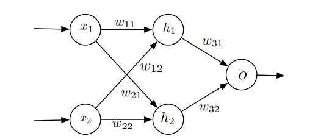

图3. 简化的多层感知器结构，具有输入X=（x1，x2）、隐藏层（h1，h2）和输出o。

---

该网络有两个输入神经元x1和x2，一个隐藏层有两个神经元h1和h2，还有一个输出神经元o。换句话说，它是一个简单的多层感知器。输入神经元x1和x2都取[0,1]中的实值，并对应于网络输入：特征向量$X=(x_1，x_2)∈ [0, 1]^2 $。隐层神经元均使用逻辑S形函数φ作为激活函数。该函数在神经网络中经常使用，因为它是连续的（可微的），在0附近表现出类似线性的行为，并且随输入变为±∞而饱和. 隐藏层中的神经元将sigmoid应用于加权输入层：例如，神经元h1使用$z_{h1}(X)=w_{11}x_1+w_{12}x_{2}+b_{1}$计算h1（X）=φ（zh1（X）），其中w11和w12是权重，b1是偏差。

### B. 对抗性目标

威胁的定义具有特定的保护/防御功能。就深度学习系统而言，分类的完整性至关重要。具体来说，深度学习系统的对手寻求提供输入X∗ 让输出分类错误。如图2的X轴所示，错误的性质代表了敌对目标。考虑影响分类器输出完整性的四个目标：

1. 置信度降低—降低输出置信度分类（从而引入类歧义）
2. 错误分类—将输出分类更改为与原始类不同的任何类
3. 定向的错误分类—产生的输入会迫使输出分类成为特定的目标类。根据图1所示的例子，对手会创建一组被归类为数字的斑点
4. 源/目标错误分类—强制将特定输入的输出分类为特定目标类。继续图1中的例子，敌人获取一个数字的现有图像，并添加少量斑点，将结果图像分类为另一个数字。

科学界最近开始探索高级深度学习。关于其他机器学习技术的先前工作将在第七节的后面部分引用。

---

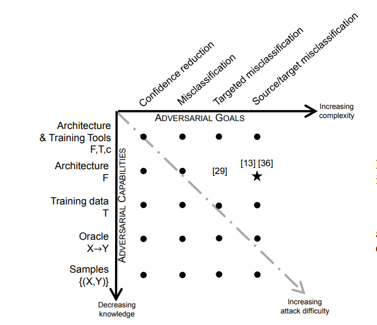

图2：威胁模型分类：我们的算法类在星号表示的威胁模型中运行

---

Szegedy等人介绍了一种系统，该系统通过干扰输入产生对抗性样本，从而产生源/目标错误分类[36]。他们专注于计算机视觉应用的工作所产生的扰动，人类无法分辨——例如，对车辆图像的微小但精心制作的扰动导致DNN将其归类为鸵鸟。作者将这种修改后的输入命名为对抗性图像，它可以概括为对抗性样本更广泛定义的一部分。在生成敌方样本时，敌方的目标是生成被人类或其他分类器正确分类（或无法区分）但被目标DNN错误分类的输入。

另一个例子是Nguyen等人提出的一种方法，用于生成人类无法识别的图像，但仍被DNN标记为可识别对象[30]。例如，他们演示了DNN如何将使用其技术构建的充满噪声的图像分类为高置信度的电视。他们将这种方法产生的图像命名为愚弄图像。**在这里，愚弄图像是一个没有源类的图像，但其制作完全是为了执行有针对性的错误分类攻击**。

敌人是由他们掌握的信息和能力来定义的。下面（以及图2的Y轴）描述了一系列通过降低对手力量（并增加攻击难度）松散组织的对手。请注意，我们只考虑在测试时进行的攻击，任何对培训程序的篡改都不在本文的范围之内

**训练数据和网络架构**——这个对手对用于分类的神经网络有着完善的知识。攻击者必须访问用于网络训练的训练数据T、函数和算法，并能够提取有关DNN架构F的知识。这包括层的数量和类型、神经元的激活函数，以及权重和偏差矩阵。他还知道用于训练网络的算法，包括相关的损失函数c。这是能够分析训练数据并全面模拟深层神经网络的最强对手。

**网络架构**——该对手了解网络架构F及其参数值。例如，这对应于一个对手，他可以收集有关（1）用于设计神经网络的层和激活函数，以及（2）训练阶段产生的权重和偏差的信息。这为对手提供了足够的信息来模拟网络。我们的算法假设了这种威胁模型，并展示了一类新的算法，为有监督和无监督前馈DNN生成对抗样本

**训练数据**——该对手能够收集一个替代数据集，从原始数据集用于训练DNN的同一分布中采样。然而，攻击者并不知道用于设计神经网络的体系结构。因此，在该模型中进行的典型攻击可能包括使用代理数据集来近似合法分类器学习的模型的通常部署的深度学习体系结构。

**原语**——这个对手有能力将神经网络（或其代理）用作原语。在这里，对手可以从提供的输入中获得输出分类（**很像密码学中选择的明文攻击**）。这使得差异攻击成为可能，对手可以观察输入和输出变化之间的关系（继续进行类比，如用于差分密码分析），从而自适应地构建对手样本。这个对手可以通过他们可能执行的绝对或速率受限输入/输出试验的数量进一步参数化。

**样本**——该对手有能力收集与神经网络分类器相关的成对输入和输出。然而，他无法通过修改这些输入来观察输出的差异。为了继续进行密码分析类比，该威胁模型将对应于**已知的明文攻击**。这些对在很大程度上被标记为输出数据，直觉表明它们很可能只在非常大量的情况下有用

## 3. 方法

在本节中，我们将介绍一种修改样本的通用算法，以使DNN产生任何敌对输出。我们随后通过让分类器将样本错误分类到选定的目标类中来验证该算法。该算法捕获在图2右上角对应的设置中制作样本的对手。我们证明，架构和权重参数2的知识足以针对非循环前馈DNN导出对抗性样本。这就需要评估DNN的前向导数，以构建一个敌方显著性图，识别与敌方目标相关的一组输入特征。干扰以这种方式识别的特征会迅速导致所需的敌对输出，例如误分类。虽然我们用有监督的神经网络作为分类器来描述我们的方法，但它也适用于无监督体系结构

### A. 学习一个简单的神经网络

回想一下之前在第二节中介绍的简单体系结构，如图3所示。它的低维性使我们能够更好地理解算法背后的基本概念。我们确实展示了使用前向导数发现的小输入扰动是如何导致神经网络输出的大变化的。

假设输入有偏差$b_1,b_2,b_3$，我们对这个玩具网络进行培训，以了解AND功能：所需输出为F（X）=x1∧ x2其中X=（x1，x2）。.注意，非整数输入被四舍五入到最接近的整数，因此我们有例如0.7∧ 0.3=0或0.8∧ 0.6 = 1

对1000个样本集使用反向传播，对应于函数的每种情况（1∧1 = 1, 1 ∧ 0 = 0, 0 ∧ 1=0，0∧ 0=0），我们使用学习率η=0.0663进行100个时代的训练。对于输入值X，神经网络学习的整体函数绘制在图4中∈ [0, 1]2 . 水平轴代表两个输入尺寸x1和x2，而垂直轴代表对应于X=（x1，x2）的网络输出F（X）。

---

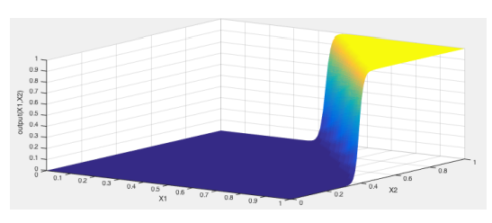

图4：输入域$[0,1]^2$的简化多层感知器的输出面。蓝色对应0输出，而黄色对应1输出

---

我们现在将演示如何在这个神经网络上制作对抗性样本。敌方认为是一个合法样本X，被网络归类为F（X）=Y,想要制作一个对抗性的样本X∗ 与X非常相似，但被错误分类为F（X∗ ) = Y∗ ≠Y。回想一下，我们将这个问题形式化为：

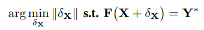

其中$X^*=X+\delta x$是对抗样本，$Y^*$是期望对抗性输出，$||\cdot ||$范数比较输入域中的点。非正式地说，对手正在搜索输入的小扰动，这将导致输出被修改为Y∗

可以使用优化技术、模拟启发式甚至蛮力来寻找这些扰动。然而，由于非凸性和非线性，这种解决方案很难用于深层神经网络[25]。

相反，我们提出了一种基于**前向导数**的系统方法

我们**将前向导数定义为神经网络在训练过程中学习的函数F的雅可比矩阵**。在这个例子中，F的输出是一维的，因此矩阵被简化为一个向量：

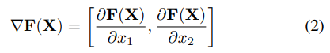

这个向量的两个分量都可以使用对手的知识进行计算，之后我们将展示如何有效地计算这个项

我们的示例网络的前向导数如图5所示，它绘制了第二个分量的梯度$\frac{\part F(x)}{\part x_2}$。在垂直轴上相对于水平轴上的x1和x2。

---

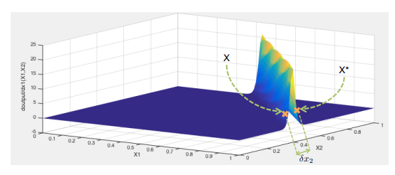

图5：根据输入神经元x2，我们简化的多层感知机正向导数。样本X为良性，样本X为良性∗ 是对抗性的，通过添加δX=（0，δx2）来实现。

---

我们省略了这个情节∂F（X）∂x1，因为F在它的两个输入端上近似对称，所以第一个分量对于我们来说是多余的。

该图便于根据分配给输入特征x2的值来可视化网络的两个可能输出之间的差距：尖峰左侧为0，左侧为1。请注意，这与图4一致，并为我们提供了实现敌对目标所需的信息：找到使输出更接近期望值的输入扰动。

参考图5和我们的示例网络，我们可以通过查看几个样本点来确认这一直觉。考虑$X=(1,0.37)$和$X^*=(1,0.43)$，都位于图5中的尖峰附近。尽管它们之间的差异很小（δx2=0.05），它们会导致网络输出的显著变化，如F（X）=0.11和F（X∗ ) = 0.95。

回想一下，我们对这个网络的输入和输出进行取整，使其与布尔and函数一致，我们发现X*是一个对立的样本：取整后，X∗ = （1,0）和F（X）∗ ) = 1.同样重要的是，前向导数告诉我们哪些输入区域不太可能产生对抗性样本，因此对对抗性操纵更具免疫力。请注意，在图5中，当任一输入接近0时，正向导数很小。这与我们的直觉一致，即找到接近（1,0）而不是（1,0.4）的敌对样本将更加困难。这告诉对手，**在构建样本时，要关注与给定输入中更大的前向导数值对应的特征，从而提高搜索效率，最终导致较小的整体扭曲**。

因此，该示例的要点是：（1）较小的输入变化可能导致神经网络输出的极端变化，（2）并非输入域中的所有区域都有助于找到对抗性样本，（3）前向导数减少了对抗性样本搜索空间

### B. 推广到前馈深层神经网络

现在，我们使用第III-A节中相同的假设和对手模型，将这种方法推广到任何前馈DNN。我们对这种结构的唯一假设是，它的神经元形成一个非循环DNN，每个神经元使用一个不同的激活函数。请注意，最后一个假设并没有限制，因为反向传播算法施加了相同的要求。在图6中，我们给出了一个前馈深度神经网络架构的示例，并定义了本文剩余部分中使用的一些符号。最重要的是，当给定M维输入X时，DNN在训练期间学习的N维函数F分配一个输出Y=F（X）。我们将N写为隐藏层的数量。层由k索引∈ 0..n+1，使得k=0是输入层k的索引∈ 1.n对应于隐藏层，k=n+1对输出层进行索引

算法1展示了我们构建对抗性样本的过程。作为输入，该算法采用良性样本X，目标输出Y∗。 一个非循环前馈DNN F，一个最大失真参数Υ，以及特征变化参数θ。它返回新的对抗性样本X∗ 使得$F(X^*)= Y^∗$。按照三个基本步骤进行：（1）计算前向导数$\nabla F(X^*)$。（2）基于导数构造显著性映射。（3）通过θ修改输入特征imax。重复此过程，直到网络输出Y∗ 或者达到最大失真Υ。现在我们详细介绍每一步

**1）深层神经网络的前向导数**：第一步是计算给定样本X的正向导数。如前所述，这由以下公式得出：

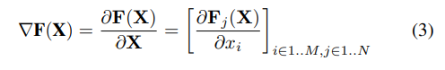

这本质上是函数的雅可比矩阵，对应于神经网络在训练中学习的内容。正导数计算的梯度与反向传播计算的梯度相似，但有两个重要的区别：

**我们直接取网络的导数，而不是有什么损失函数**，我们根据输入特征而不是网络参数进行区分。因此，我们在方法中选择向前传播梯度，而不是向后传播梯度，因为这允许我们找到导致网络输出显著变化的输入组件

我们的目标是只使用$X$和常数来表达$\nabla F(X^*)$。为了简化表达式，我们现在考虑方程3中定义的前向导数矩阵中的一个元素（i，j）$\in [1,M]\times [1,N]$。这是一个输出$F_j$关于输入$x_i$的微分。当然，对于任何矩阵元素，我们的结果都是正确的。我们从神经网络的第一个隐藏层开始。我们可以根据输入组件区分第一个隐藏层的输出。然后我们递归地区分每个隐藏层k∈ 2.n：

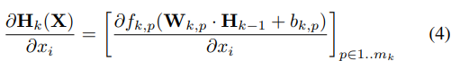

其中Hk是隐层k的输出向量，$f_{k,p}$是第k层输出神经元j的激活函数。

隐藏层或输出层上的每个神经元p（索引为k∈ 1.n+1）连接到上一层k− 1，使用$W_{k,j}$中定义的权重。

通过相应地定义权重矩阵，我们可以定义完全或稀疏连接的中间层，从而对各种架构进行建模。类似地，我们写出了k层神经元p的偏差bk，p。通过应用链式规则，我们可以写出k的一系列公式∈ 2.n:

因此，我们能够表达∂嗯∂席。我们知道输出神经元j计算以下表达式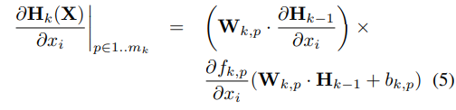

因此，我们能够表达$\frac{\part H_n}{\part x_i}$。我们知道输出神经元j计算以下表达式

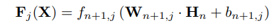

因此，我们再次应用链式规则来获得

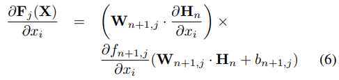

在这个公式中，根据我们的威胁模型，所有术语都是已知的，只有一个：$\frac{\part H_n}{\part x_i}$。这正是我们递归计算的项。通过将连续层的这些结果插回到方程6中，我们得到了DNN正导数的分量（i，j）的表达式。因此，F的前向导数∇F可以通过从输入层开始直到到达输出层为止连续区分层来计算任意输入X。我们稍后将在评估方法中讨论∇F的计算性，针对SOTA DNN结构。值得注意的是，前向导数可以使用符号微分来计算

**2） 敌对显著性图**：我们扩展了先前作为可视化工具引入的显著性图[34]，以构建敌对显著性图。这些地图指出了敌方应干扰哪些输入特征，以便最有效地实现网络输出的预期变化，因此是多功能工具，允许敌方生成广泛类别的敌方样本

对抗显著性图的定义是为了适应特定问题的对抗目标。例如，我们后来研究了一个用作分类器的网络，其输出是跨类的概率向量，其中最终预测的类值对应于概率最高的组件：

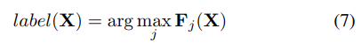

因此，在我们的例子中，显著性图是基于前向导数的，因为这为对手提供了导致神经网络对给定样本进行错误分类所需的信息。更准确地说，对手希望对样本X进行错误分类，以便为其分配目标类别$t\neq label(X)$。为此，必须增加由F给出的目标类t的概率Ft（X），同时所有其他类的$j\neq t$概率Fj（X）减小，直到t=arg maxj Fj（X）。对手可以通过使用以下显著性图S（X，t）增加输入特征来实现这一点：

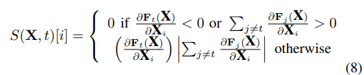

其中i是一个输入特征。第一行中指定的条件会拒绝具有负目标导数或其他类别的整体正导数的输入分量。确实，$\frac{\part F_t(X)}{\part X_i}$应该为正，当特征Xi增加时，Ft（x）增加。同样.......。

第二行上的乘积允许我们考虑所有其他前向导数分量，这样我们就可以很容易地比较所有输入特征的S（x，t）[i]。总之，S（X，t）[i]的高值对应于将增加目标类别或显著减少其他类别，或两者兼而有之。通过增加这些特性，对手最终会将样本错误分类到目标类中。图7显示了一个显著性图示例

可以使用前向导数定义其他敌对显著性地图，地图的质量会对算法1引入的失真量产生很大影响；稍后我们将对此进行更详细的研究。在继续之前，我们引入了一个额外的地图，通过寻找对手**应该减少的特征来实现错误分类**，它与等式8中给出的地图相当。唯一的区别在于对正向导数值的约束以及绝对值在第二行中的位置

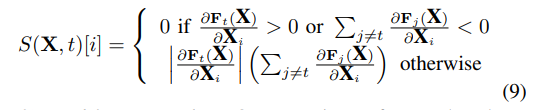

---

图7:LeNet架构784维输入的显著性图（**参见验证部分**）。784输入尺寸的排列与28x28图像像素对齐相对应。较大的绝对值对应于扰动时对输出有显著影响的特征

---

3） 修改样本：一旦一个输入特征被对手的显著性图识别出来，就需要对其进行扰动以实现对手的目标。在算法1的每次迭代的最后一步中，选定特征的**扰动量**（算法1中的θ）也是特定于问题的。我们将在第四节讨论如何在计算机视觉应用程序中设置该参数。最后，由参数**Υ指定的最大迭代次数**，相当于样本中允许的最大失真。它限制了为制作对抗性样本而更改的功能的数量，并且可以获取任何小于功能数量的正整数值。找到Υ的正确值需要考虑失真对人类对敌对样本感知的影响——过多的失真可能会导致人类很容易识别敌对样本。

## 4. 方法的应用

我们使用三种工具：前向导数、对抗显著性映射和构造算法，正式描述了一类用于构造由前馈DNN错误分类的对抗性样本的算法。现在，我们将这些工具应用于用于计算机视觉分类任务的DNN：手写数字识别。我们证明，我们的算法成功地从任何源类到任何给定的目标类构建了对抗性样本，这对于这个应用来说意味着任何数字都可能受到干扰，从而被误分类为任何其他数字。

我们研究了一种基于研究充分的LeNet体系结构的DNN，该体系结构已被证明是手写数字的优秀分类器[26]。最近的体系结构，如AlexNet[24]或GoogLeNet[35]严重依赖于LeNet体系结构中引入的卷积层，因此LeNet成为验证我们方法的相关DNN。我们没有理由相信我们的方法不会在更大的体系结构上表现良好。网络输入是手写数字的黑白图像（28x28像素），这些图像被展平为784个特征的向量，其中每个特征对应于采用0到1之间标准化值的像素强度。该输入由一系列重复两次的卷积层（20个然后50个5x5像素的内核）和池层（2x2滤波器）、完全连接的隐藏层（500个神经元）和输出softmax层（10个神经元）处理。输出是一个10类概率向量，其中每个类对应于0到9之间的一个数字，如图8所示。然后，网络将输入图像标记为指定了最大概率的类别，如等式7所示。我们使用60000个样本的MNIST训练数据集来训练我们的网络[27]。

我们试图确定，使用前面章节介绍的理论框架，我们是否能够有效地制作被DNN错误分类的对抗性样本。例如，如果我们有一个手写数字0的图像X，被网络分类为$label(X)=0$，并且对手希望制作一个对手的样本X∗ 根据这张分类为$label(X)=7$，源类为0，目标类为7。理想情况下，制作过程必须找到构造对抗性样本X所需的最小扰动δX∗ = X+δX。扰动是一组像素强度——或输入特征变化——被添加到X中以形成X∗ . 请注意，制造对抗性样本时引入的扰动必须对人类无法区分

### A. 手工算法

算法2展示了我们在实验中使用的手工算法，我们用Python实现了该算法（有关实现的更多信息，请参见附录A）。它基于算法1，但为了解决我们的手写数字识别问题，一些细节已经改变。给定一个网络F，**算法2通过扰动两个输入特征（即像素强度）p1和p2（由显著性_映射选择）**，迭代修改样本X。在算法的每次迭代之间，使用DNN的前向导数$\nabla F(X^*)$构造和更新显著性图. 当满足以下条件之一时，该算法停止：（1）敌方样本由DNN以目标类t分类，（2）已达到最大迭代次数，**或（3）特征搜索域Γ为空**。手工算法通过三个参数进行微调：

1. 最大失真Υ：定义算法何时停止修改样本以达到敌对目标类。以**百分比**表示的最大失真对应于制作对抗性样本时要修改的最大像素数，因此将最大迭代次数max_iter（每次迭代修改2个像素）设置如下：

   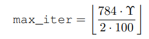

   其中784=28×28是样本中的像素数

2. 显著性图：子例程显著性图生成一个图，定义在每次迭代中修改哪些输入特征。用于生成显著性图的策略因所考虑的DNN处理的数据的性质以及敌对目标而异。我们在后面的算法3中提供了一个子程序示例

3. 每次迭代的特征变化θ：一旦使用显著性图选择了输入特征，就必须对其进行修改。引入这些特征的变化θ是对手必须根据其使用的显著性图设置的另一个参数

找到这些参数的良好值是我们当前评估的一个目标，将在第五节稍后讨论。目前，请注意，人类感知是一个限制因素，因为它限制了可接受的最大失真和引入的特征变化。现在，我们用两种不同的对抗策略展示我们的框架的应用

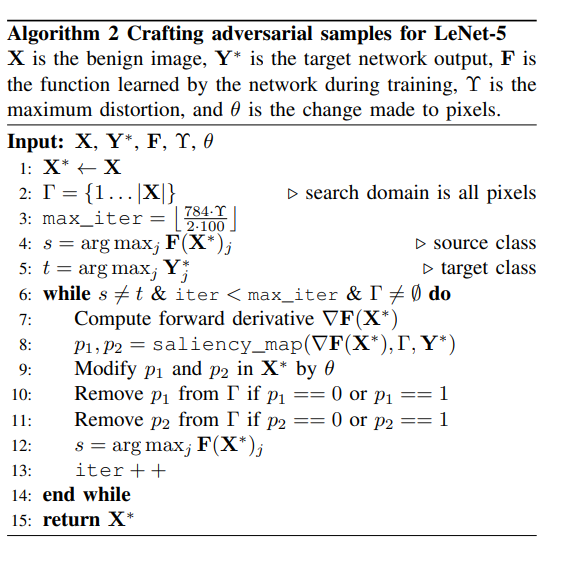

注意这里的Remove细节！

### B. 通过增加像素强度来制作

制作对抗性样本的第一个策略是增加某些像素的强度。为了实现这一目的，我们考虑10个样本的手写数字从MNIST测试集，一个从每一个数字类0到9。我们使用这个小样本子集来说明我们的技术。在第五节中，我们将评估扩展到整个数据集。

我们的目标是报告我们是否能达到给定源类的任何敌对目标类。例如，如果给我们一个手写的0，我们增加一些像素强度，以产生9个敌对样本，分别分类在1到9类中。所有改变的像素强度增加**θ=+1**。我们将在第五节中讨论参数的选择

我们允许无限的最大失真Υ=∞. 我们只需测量90个源-目标类对中的每一个是否可以产生对抗性样本

在手工算法中用于选择可增加的像素对的对抗性显著性图是在等式8的一般分类情况下引入的地图的应用。该地图旨在使用以下启发式方法找到成对的像素（p1、p2）

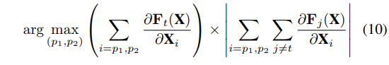

其中t是目标类的索引，乘法运算的左操作数被约束为正，乘法运算的右操作数被约束为负。本文前一节介绍的这种启发式算法，搜索产生目标类输出增加的像素对，同时减少所有其他类输出的总和。算法3给出了相应子程序显著性映射的伪代码。

**显著性图考虑的是成对的像素，而不是单个像素，因为一次选择一个像素太严格了，很少有像素会满足等式8中描述的启发式搜索标准**。搜索成对的像素更有可能匹配条件，**因为其中一个像素可以补偿另一个像素的微小缺陷**。让我们考虑一个简单的例子：P1具有5的目标导数，但其他类导数的和等于0.1，而P2作为目标导数等于−0.5和其他类别导数之和等于−6.单独而言，这些像素不符合等式8中所述的显著性映射标准，但结合起来，这对像素确实符合等式10中定义的显著性标准。人们还可以设想考虑使用更大的输入特征组来定义显著性图。然而，这需要更大的计算成本，因为每次组大小增加时需要考虑更多的组合

在这些算法的实现中，我们使用最后一个隐藏层而不是输出概率层来计算网络的前向导数。这是由这两层之间计算的逻辑回归引入的极端变化证明的，以确保概率总和为1，从而导致极端导数值。这降低了神经元如何被不同输入激活的信息质量，并导致在生成显著性图时前向导数的精度降低。最后一个隐藏层也由10个神经元组成，每一个神经元对应一个数字级0到9，当使用该层时，可以获得更好的结果

（↑这一段似乎有疑问？）

**这证明了对正向导数施加约束是合理的**。实际上，由于用于计算前向导数的输出层总和不等于1，增加$F_t(X)$并不表明$\sum_{j\neq t} \part F_j(X)$将会减少，或者相反。

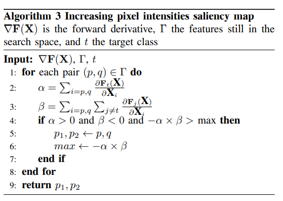

该算法能够为所有90个源-目标类对制作成功的对抗性样本。图1显示了获得的90个对抗性样本以及用于制作它们的10个原始样本。原始样品位于对角线上。当$i\neq j$时，第i行和第j列上的样本是根据最初被分类为源类i的图像制作的样本，该图像将被错误分类为目标类j。

为了验证我们算法的有效性，以及更具体地验证我们的对抗显著性图，我们运行了一个简单的实验。我们在一个空输入（所有像素最初设置为0的强度）上运行制作算法，并为每个类从0到9制作一个敌对样本。图9所示的不同样本展示了敌对显著性地图如何能够识别与类中分类相关的输入特征。

### C. 通过降低像素强度来制作

第二种对抗策略不是增加像素强度以达到更高的目标，而是将像素强度降低θ=−1.实施与对抗显著性地图的例外情况相同

公式与之前在等式10中所写的相同，但约束条件不同：乘法运算的左操作数现在被约束为负，右操作数被约束为正。这种启发式算法也在本文前面的章节中介绍过，它会搜索产生目标类输出增加的像素对，同时减少所有其他类输出的总和。

该算法再次能够为所有源-目标类对制作成功的高级样本。图10显示了获得的90个对抗性样本以及用于制作它们的10个原始样本。要进行的一项观察是，通过降低像素强度引入的失真似乎更难被人眼检测到。我们将在第五节后面的一项研究中讨论人类感知方面

---

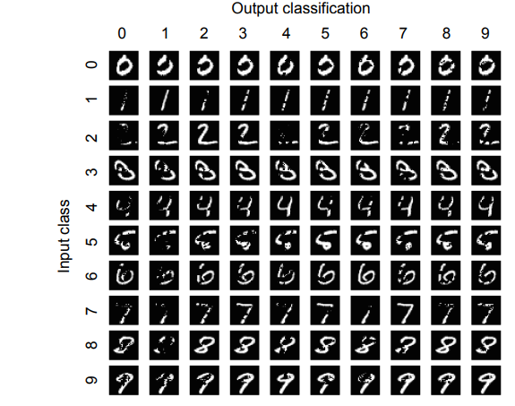

图10：通过降低像素强度获得的对抗性样本。MNIST数据集中的原始样本位于对角线上，而敌对样本均为非对角线元素。样本按列组织，每个列对应于0到9之间的类。

---

## 5. 评价

我们现在使用我们的实验设置来回答以下问题：（1）“我们可以利用任何样本吗？”，（2） “我们如何识别比其他样本更脆弱的样本？”（3）“与DNN相比，人类如何看待对抗性样本？”。我们的主要结果是，通过平均修改4.02%的样本，可以为我们的验证问题可靠地制作对抗性样本，成功率为97.10%。我们定义了一个难度度量来识别比其他类更容易利用的样本类。这一措施对于设计强大的防御系统是必要的。我们还发现，人类无法感知制造被DNN分类的对抗性样本时引入的扰动：他们仍然正确地对失真小于14.29%的对抗性样本进行分类

### A. 制作大量对抗性样本

既然我们之前展示了为所有源-目标类对制作对抗性样本的可行性，那么我们将尝试测量制作算法是否能够成功处理大量手写数字的不同样本。也就是说，我们现在设计了一组实验来评估MNIST数据集中的所有合法样本是否都可以被对手利用来产生对抗性样本。我们在三组10000个样本上运行我们的手工算法，每个样本从三个MNIST训练、验证和测试子集中的一个提取。对于这些样本中的每一个，我们制作了9个对抗性样本，每个样本都被分类在9个目标类中的一个，与原始合法类不同。因此，我们为每一组生成了90000个样本，总共产生了270000个对抗性样本。我们将最大失真设置为Υ=14.5%，像素强度增加θ=+1。在研究增加最大失真对成功率τ的影响后，确定了最大失真。我们发现97.1%的对抗性样本可以在失真小于14.5%的情况下制作，并且观察到，对于较大的最大失真，成功率没有显著增加。**参数θ被设置为+1，在观察到减少它或给它负值会增加修改的特征数量后，我们感兴趣的是减少在制作过程中修改的特征数量。人们还会注意到，由于特征在0和1之间进行了规格化，如果我们引入θ=+1的变化，我们总是将像素设置为其最大值1。这证明了为什么在算法2中，我们在每次迭代结束时从搜索空间中移除修改过的像素。**这对性能的影响是有益的，因为我们在每次迭代时减少了特征搜索空间的大小。换句话说，我们的算法在没有回溯的情况下执行最佳优先启发式搜索

我们在三组10000个样本上测量对抗性样本的成功率τ和失真。成功率τ定义为被DNN成功分类为对抗性目标类别的对抗性样本的百分比。失真定义为合法样本中为获得对抗性样本而修改的像素百分比。换句话说，它是为了获得对抗性样本而修改的输入特征的百分比。我们计算**两个平均失真值：一个考虑所有样本，另一个只考虑成功样本**，我们写ε。图11显示了从中提取原始样本的三组样本的结果。所有数据集的结果都是一致的。平均而言，成功率为τ=97.10%，所有对抗性样本的平均畸变率为4.44%，成功对抗性样本的平均畸变率为ε=4.02%。这意味着为制作成功的对抗性样本而修改的平均像素数为784像素中的32像素。第一个失真数字更高，因为它包括不成功的样本，对于这些样本，手工算法使用了最大失真Υ，但无法导致错误分类。

---

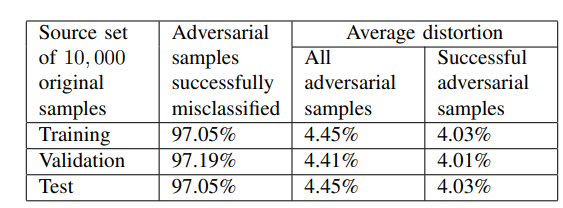

图11：10000个样本的大样本集的结果

---

我们还研究了使用递减显著性图制作9000个对抗性样本。我们发现成功率τ=64.7%较低，平均畸变ε=3.62%略低。同样，与增加像素强度相比，降低像素强度在产生所需对抗行为方面不太成功。**直观地说，这是可以理解的，因为移除像素会降低信息熵，从而使DNN更难提取样本分类所需的信息**。强度变化的绝对值越大，DNN的错误分类就越有把握

### B. 量化难度并建立防御机制

看看之前的实验，在27万份对抗性样本中，约有2.9%没有成功制作。这表明一些样本比其他样本更难利用。此外，报告的失真数据在所有产生的对抗性样本上都是平均的，但并非所有样本都要求对相同的失真进行错误分类。因此，我们现在研究不同样品的难度，以量化这些现象。我们的目标是**确定哪些源-目标类对最容易利用，以及不同源-目标类对之间的相似性**。类对是源类s和目标类t的一对。这个硬度度量允许我们为防御机制奠定基础

1） 类对研究：在本实验中，我们对不同源目标类对的手工算法的成功率和平均失真有了更深入的了解。我们使用了在之前的实验中从MNIST测试集的10000个样本中提取的90000个对抗性样本。

我们将图11中报告的成功率τ按源-目标类对进行细分。这使我们能够知道，对于给定的源类，在每个目标类中，该类的多少个样本被成功地错误分类。在图12中，我们绘制了**成功率矩阵**，指出哪些配对最成功。**颜色越深，成功率越高**。行对应于每个源类的成功率，而列对应于每个目标类的成功率。如果按行读取矩阵，可以看出类0、2和8很难开始，而类1、7和9很容易开始。类似地，从矩阵列的角度来看，我们可以观察到类1和7很难生成，而类0、8和9很容易生成。

在图13中，我们报告了源目标类对成功样本的平均失真ε，从而确定了需要最大失真才能成功制作对抗性样本的类对。有趣的是，在前一个矩阵中，要求较低失真的类对应于成功率较高的类。例如，与类别1相对应的列与最高的失真相关，而它是前一个矩阵中成功率最低的列。事实上，类对的平均失真越高，该类对中的样本就越有可能达到最大失真，从而产生不成功的对抗性样本。

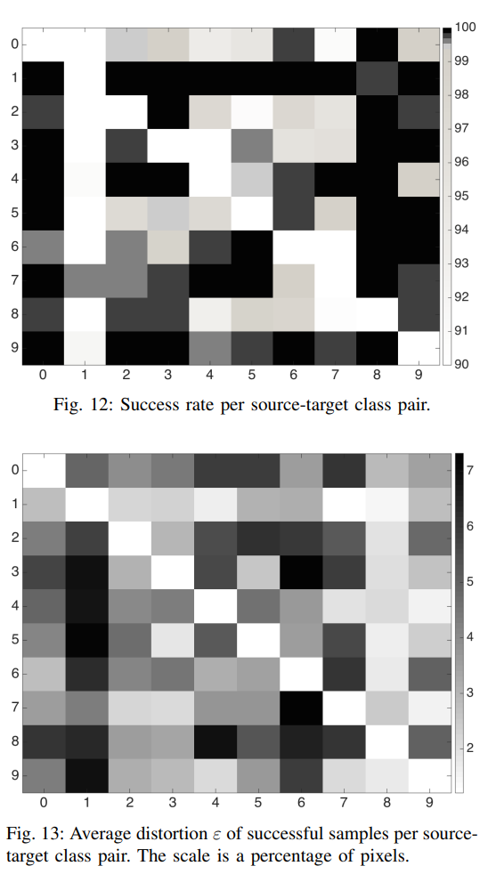

为了更好地理解为什么某些类对更难利用，我们跟踪了制作过程中类概率的演变。我们观察到，对于高失真的类对，离开源类所需的失真更高，而一旦离开源类，到达目标类所需的失真保持相似。这与DNN对某些源类的分类比其他源类更可靠这一事实有关。

2） 难度度量：结果表明，一些源类和目标类对不像其他类对那么容易，这让我们质疑是否存在量化两个类之间距离的度量。这与寻求确定哪类DNN最容易受到对手攻击的防御者有关。我们将这个度量命名为目标类相对于给定源类的硬度。它标准化了类对（s，t）相对于其成功率的平均失真：

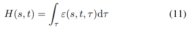

其中ε（s，t，τ）是**一组样本对应成功率τ的平均失真**。在实践中，这两个量是通过在手工算法中固定一组K最大失真参数值ΥK来计算的，其中K∈ 1.K。因此，用于计算源-目的类别对硬度的实用公式可以从梯形规则推导得出：

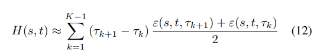

我们使用一组K=9最大变形值Υ计算了所有类的难度值，其中Y∈ 算法中{0.3,1.3,2.6,5.1,7.7,10.2,12.8,25.5,38.3}%。对于每个最大失真值Υ，平均失真ε和成功率τ在9000个敌对样本上取平均值。图14显示了所有对（s，t）的硬度值H（s，t）∈ {0..9} 2 . 读者将观察到，该矩阵的形状类似于图13中绘制的平均失真矩阵。然而，难度测量更准确，因为它是使用一系列最大变形绘制的

---

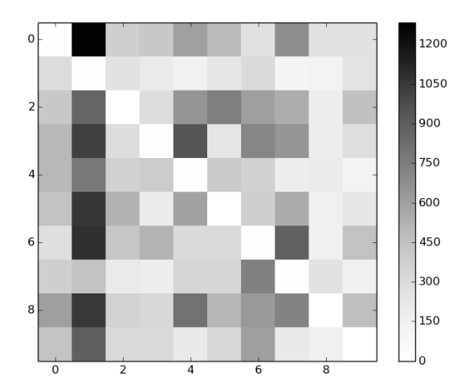

图14：源-目标类别对的难度矩阵。较深的阴影对应于更难实现的错误分类

---

3） 对抗距离：引入的措施为找到对抗性样本的防御措施奠定了基础。**事实上，如果难度测量是预测性的，而不是在对抗性制作后计算出来的，那么防御者可以识别出易受攻击的输入**。此外，适用于单个样本的预测性度量将允许防御者评估特定样本以及类对的脆弱性。我们研究了几个复估计，包括前向导数或Hessian矩阵的卷积变换。然而，我们发现，在我们的实验装置中，简单地使用从对立显著性图背后的直觉推导出的公式，就足以预测样本的难度。

我们将这种预测性度量称为样本X到类t的对抗距离，并将其写成A（X，t）。简单地说，它估计样本X和目标类别t之间的距离。我们将距离定义为：

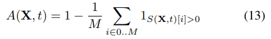

式中，$1_E$是事件E的指示函数（即，当且仅当E为真时为1）

简言之，a（X，t）是在算法2的第一次工艺迭代中计算的X的对抗显著性图中非零元素的标准化数量。对抗距离越接近1，样本X就越难在目标类别t中错误分类。图15证实了该公式在经验上是有充分依据的。它说明了每个源-目的地类别对的平均对抗距离值，便于将平均值与之前制作样本后计算的硬度矩阵进行比较。为了计算它，我们稍微修改了等式13，将成对的特征相加，以反映验证过程中的观察结果。

---

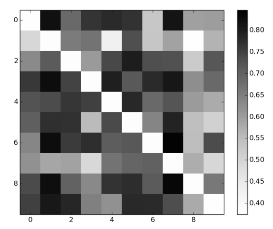

图15：用1000个样本计算出每个源-目的类别对的平均对抗距离。

---

类间距离的概念直观地定义了网络F抵抗敌对干扰的鲁棒性度量。我们建议使用以下定义：

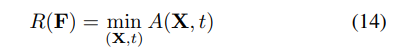

其中，考虑的样本集X足够大，足以代表网络的输入域。利用训练数据集可以计算出鲁棒性的良好逼近。请注意，此处使用的最小运算符可以被其他相关运算符替换，如统计期望。对各种操作员的研究将作为未来的工作

### C. 研究人类对敌对样本的感知

回想一下，对抗性样本不仅必须被深度神经网络误分类为目标类，而且还必须被人类视为源类。为了评估这一特性，我们在Mechanical Turk在线服务上对349名人类参与者进行了实验。我们向人类参与者展示了来自MNIST数据集的三个原始或逆向改变的样本。换言之，参与者被要求提供每个样本：（a）“这个样本是数字吗？”，（b）“如果（a）是什么数字？”。这两个问题旨在确定失真率和强度率如何影响人类对样本的感知。

第一个实验旨在确定输入数据的基线感知率。74名参与者从原始MNIST数据集中随机抽取222个未经改变的样本中的3个。受访者将97.4%的数字识别为数字，并将95.3%的样本中的数字正确分类。如图16所示，第二组实验试图评估失真量（ε）如何影响人类感知。在这里，184名参与者总共收到了1707个不同程度失真的样本（特征随着强度增加θ=+1而改变）。实验表明，在低于阈值（ε=14.29%失真）的情况下，参与者能够将样本识别为数字（95%），并将其正确分类（90%），但准确度略低于未改变的样本。当失真率高于阈值时，分类率急剧下降（71%）

---

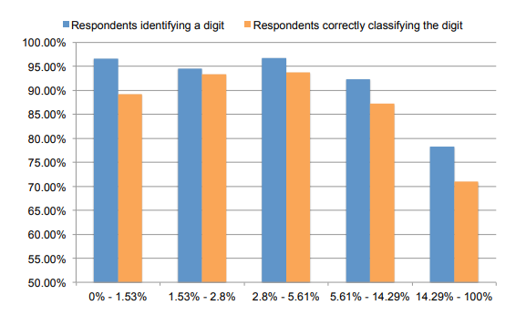

图16：人类对不同扭曲的感知ε

---

最后一组实验评估了强度变化（θ）对感知的影响，如图17所示。203名参与者准确地将5355个样本识别为数字（96%），并正确分类（95%）。在较高的绝对强度下（θ=−1和θ=+1），具体数字分类略有下降（90.5%和90%），但作为数字的识别基本上没有变化。

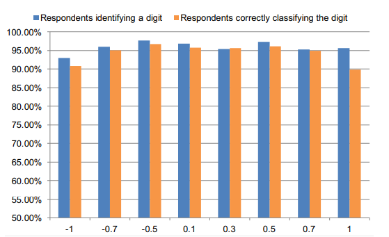

图17：人类对不同强度变化θ的感知。

---

虽然是初步的，但这些实验证实，生成的样本数量过多，仍能保持人类的可识别性。注意，因为我们可以为几乎所有的输入数据生成小于失真阈值的样本，（ε≤ 14.29%（MNIST数据中约97%）我们可以生产出人类会错误解释的对抗性样本，从而达到我们的对抗性目标。此外，改变特征扭曲强度可以提供更好的结果：在−0.7≤ θ ≤ +0.7，人类以与原始样本数据基本相同的速率对样本数据进行分类。

## 6. 讨论

我们引入了一类新的算法，一旦敌方掌握了DNN体系结构的知识，该算法就可以系统地生成被DNN误分类的敌方样本。尽管我们的工作重点是在分类环境中使用的DL技术，并用有监督的方法进行培训，但我们的方法也适用于无监督的体系结构。对手没有达到给定的目标类别，而是达到了目标输出Y∗ . 因为输出空间更复杂，所以可能更难或不可能匹配Y∗ . 在这种情况下，方程1需要放松，网络输出F（X*）和Y*之间的距离可以接受  . 因此，本文剩下的唯一假设是DNN是前馈的。换言之，我们没有考虑递归神经网络，在它们的体系结构中具有循环，因为前向导数必须适应以适应这样的网络。

与之前的工作相比，我们的一个关键结果是减少了失真，即为了制作对抗性样本而改变的特征数量。我们认为，这使得恶意软件可执行文件等输入域的对抗性手工制作变得更加容易，这些输入域不像图像[11]，[16]那样容易干扰。这种破坏性的减少伴随着性能成本。事实上，对于攻击者来说，更复杂但更精确的显著性映射公式计算起来更昂贵。我们想强调的是，我们的方法的高成功率可以进一步提高，对手只对制作有限数量的样本感兴趣。事实上，为了降低一个特定样本的失真，敌方可以使用敌方显著性映射来微调引入的扰动。另一方面，如果对手想要制作大量对抗性样本，性能很重要。在我们的评估中，我们平衡了这些因素，在不到一秒钟的时间内制作出针对DNN的对抗性样本。就我们的算法实现而言，**计算成本最高的步骤是从前向导数矩阵构造对抗显著性映射所需的矩阵操作**。复杂性取决于输入特征的数量。这些矩阵运算可以更高效，尤其是通过更好地利用GPU加速计算。

到目前为止，我们的努力代表了“减少对抗样本”的第一步，但意义重大：硬度和平均距离指标为防御机制奠定了基础。虽然设计这样的防御不在本文的范围之内，但我们概述了两类防御：（1）对抗性样本检测和（2）DNN鲁棒性的改进。

开发对抗性样本检测技术是一种被动的解决方案。在我们的实验过程中，我们注意到，例如，可以通过评估样本的规律性来检测对抗性样本。更具体地说，在我们的应用示例中，敌对样本的每对相邻像素之间的平方差之和始终高于良性样本。然而，没有先验的理由假设这种技术能够可靠地检测不同环境下的敌对样本，因此扩展这种方法是未来工作的一种途径。[19]中提出了另一种方法，但不成功，因为通过将用于检测的去噪自动编码器与原始DNN叠加，敌方可以再次产生敌方样本

第二类解决方案旨在改进培训，从而提高DNN的健壮性。有趣的是，对抗性样本的问题与训练密切相关。对生成性对抗网络的研究表明，两个DNN之间的两人博弈可以从训练集中生成新样本[17]。这有助于扩充训练数据集。此外，向训练集中添加对抗性样本可以起到正则化器的作用[18]。我们在实验中还观察到，使用对抗性样本进行训练会使制作额外的对抗性样本变得更加困难。事实上，通过向原始MNIST训练数据集中添加18000个对抗性样本，我们训练了DNN的一个新实例。然后，我们在这个新训练的网络上再次运行我们的算法，并制作了一组9000个对抗性样本。对这些对抗性样本的初步分析表明，成功率降低了7.2%，而平均失真率增加了37.5%，这表明使用对抗性样本进行训练可以使DNN更加健壮

（后面部分略）