## 摘要

生成对抗性示例是评估和提高学习机鲁棒性的关键步骤。到目前为止，大多数现有方法只适用于分类，并不是为了改变当前问题的真实性能度量而设计的。我们介绍了一种新的灵活方法Houdini，用于生成对抗性示例，该示例专门针对所考虑任务的最终性能度量，无论是组合的还是不可分解的。我们成功地将Houdini应用于语音识别、姿势估计和语义分割等领域。**在所有情况下，基于Houdini的攻击都比基于用于训练模型的传统代理的攻击获得了更高的成功率**，**同时使用了不太明显的敌对干扰。**

## 1 简介

深度学习通过在图像分类[20,16]、语音识别[2]、人体姿势估计[35]和机器翻译[4]等众所周知的难题上实现几次突破，重新定义了机器智能的前景[22]。从自动驾驶汽车到自动对话代理，最成功的模型几乎渗透到了技术行业的所有领域，因此，重新审视深度学习模型的评估协议，设计新的方法来评估其可靠性，超越传统指标，变得至关重要。评估神经网络对对抗性示例的鲁棒性是朝着这个方向迈出的一步[32]。对抗性示例是通过在合法示例中添加特殊噪音精心制作的合成模式。它们无法与人类的合法例子区分开来，但它们已经显示出强大的能力，能够导致最先进的分类系统发生灾难性故障[12,25,21]。对抗性示例的存在突出了机器学习系统的潜在威胁[28]，可能会限制其在安全敏感应用中的应用。它引发了一系列关于理解这一现象[10,11]，并使神经网络更加健壮[29,7]的研究。

对抗性示例对于可靠评估和提高模型的稳健性至关重要[12]。理想情况下，必须生成它们来改变直接考虑的应用程序特有的任务损失。例如，为攻击语音识别系统而精心设计的对抗性示例应设计为最大限度地提高目标系统的单词错误率。现有的生成对抗性示例的方法利用给定可微损失函数的梯度来指导合法示例附近的搜索[12,25]。不幸的是，几个感兴趣的结构化预测问题的任务损失是一个组合的不可分解量，不适用于基于梯度的方法来生成对抗性示例。例如，评估人体姿势估计的指标是正确关键点的百分比（由头部标准化）。自动语音识别系统是根据单词（或音素）错误率来评估的。类似地，语义切分的质量由基本事实和预测之间的联合交集（IOU）来衡量。**所有这些评估指标都是不可微的**。

解决监督学习中这一障碍的方法有两种。**第一种方法是使用一致可微的替代损失函数代替任务损失**[5]。这是一个保证渐近收敛于任务损失的代理项。**第二种选择是使用直接损失最小化等方法直接优化任务损失**[14]。这两种策略都有严重的局限性。（1） 使用可微替代物进行分类是令人满意的，因为此类替代物与分类精度之间的关系已得到充分证实[34]。上述结构化预测任务的情况有所不同。事实上，对于这些问题中传统使用的代词（例如，语音识别中的连接主义时间分类损失），没有已知的一致性保证，设计一个新的代词是非常重要的，并且取决于问题。充其量，我们只能期望代理与任务损失之间存在高度的正相关。（2） 直接极小化方法更需要计算，因为它们需要为每个参数更新解决一个计算代价高昂的损失增强推理。此外，它们对超参数的选择非常敏感。因此，很难为结构化预测问题生成对抗性的示例，因为当代理不能严格逼近任务损失时，它需要大量的领域专业知识，几乎不能保证成功

**结果**：在这项工作中，我们介绍了Houdini，这是第一种通过生成对抗性示例来愚弄任何基于梯度的学习机的方法，这些示例直接针对任务的兴趣损失，无论是组合的还是不可微的。我们展示了胡迪尼与所考虑问题的任务损失之间的紧密关系。我们首次成功攻击了一个深度自动语音识别（ASR）系统，即基于DeepSpeech-2的体系结构[1]，方法是生成人类无法区分的敌对音频文件（经ABX实验验证）。我们还通过在黑盒攻击场景中愚弄Google Voice，演示了语音识别中对抗性示例的可转移性：使用我们的模型生成的对抗性示例与人类无法区分的合法示例导致Google Voice应用程序的无效转录（见图9）。我们还介绍了第一个成功的针对深度模型的无目标攻击，用于人体姿势估计[26]。类似地，我们验证了对语义分割系统进行无目标和有针对性攻击的可行性[38]，并表明我们可以让该系统对给定图像产生我们选择的任意分割的幻觉。图1显示了一个实验，我们让网络产生了一个仆从的幻觉。在所有情况下，由于Houdini的分析梯度，我们的方法生成的对抗性示例比每种不同的代理（专门为所考虑的模型设计）都更高质量，并且没有额外的计算开销。

## 3 Houdini

让我们考虑一个由$\theta$参数化的神经网络$g_\theta$ 和一个给定问题的任务损失$l(\cdot)$。我们假设任意目标y的 l（y，y）=0。样例（x，y）在网络输出的打分是gθ（x，y），遍历所有y得到的最大值就是网络的预测输出

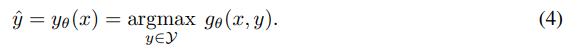

使用第2节的术语，找到一个对抗性的例子，就所选的p-范数和噪声参数的任务损失 l（·）愚弄模型gθ，归结为：

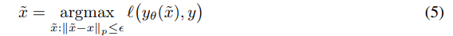

任务损失通常是一个难以优化的组合量，因此它被一个可微的**替代损失**所取代，表示为 l（yθ（~x），y）。不同的算法使用不同的代理损失函数：结构SVM使用结构铰链损失，条件随机场使用对数损失等。我们提出了一个名为Houdini的代理，并针对给定的示例（x，y）定义如下：

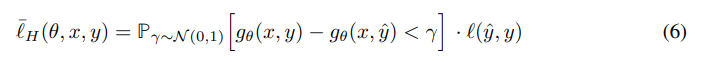

（注意这个P式子里面在变化的是$\gamma$）

换句话说，胡迪尼是两个项的产物。第一项是随机裕度，即实际目标gθ（x，y）和预测目标gθ（x，yˆ）的得分之差小于γ∼ N（0，1）的概率。**它反映了模型对其预测的信心**。第二项是任务损失，给定两个目标，它独立于模型，与我们最终感兴趣的最大化相对应。**胡迪尼是任务损失的下限**。

（这里第二项就是我们所说的不可微的优化目标，我们在迭代中固定了$y,\hat y,l(\hat y,y)$，也就是说不变，这样就体现了和真正优化目标之间的关系）

确实表示δg（y，yˆ）=gθ（x，y）−gθ（x，yˆ）是网络分配给真相和预测的分数之间的差值。我们有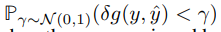小于1

因此，当这个概率变为1时，或者当网络分配给目标yˆ的分数无界限增长时，Houdini收敛到任务损失。这是我们工作中感兴趣的应用程序中使用的大多数代理所没有的独特属性。它确保Houdini是生成对抗性示例的任务损失的良好代理

我们现在可以用Houdini来代替问题5中的任务loss l（·）。接下来的2，我们求助于一阶近似，它需要Houdini相对于输入x的梯度。后者是根据链式规则获得的：

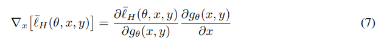

为了计算上述量的RHS，我们只需要计算Houdini对其输入（网络输出）的导数。其余部分通过反向传播获得。与网络输出相关的损失导数为：

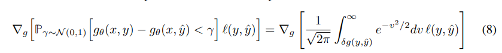

因此，展开右侧并表示C=1/√ 2π我们有：

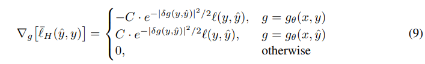

等式9提供了一个简单的分析公式，用于计算Houdini相对于其输入的梯度，因此是通过反向传播获得相对于网络x输入的梯度的有效方法。根据所考虑的攻击形式，梯度可以以两种方式与任何基于梯度的对抗性示例生成程序结合使用[12,25]。对于非目标攻击，我们希望更改网络的预测，而无需优先考虑最终预测。在这种情况下，可以使用任何替代目标y（例如，得分第二高的人作为目标）。对于目标攻击，我们将y设置为期望的最终预测。还要注意的是，当预测目标的分数非常接近地面真实值（或期望目标）的分数时，也就是当δg（y，yˆ）很小时，正如我们从我们想要愚弄的训练网络中所期望的那样，我们有e−|δg（y，yˆ）|2/2'1。在接下来的部分中，我们将展示所提出的攻击方案在人体姿势估计、语义分割和自动语音识别系统上的有效性

（记住，本文要解决的是原问题损失函数不可微的问题，这类问题求解困难，生成对抗样本更加困难，本文给出了一个不依赖于任务的统一攻击代理函数）

## 4. 人体姿态估计

我们评估了在对抗性攻击人类姿势估计神经模型的情况下Houdini损失的有效性。在操纵监控摄像头、改变犯罪现场分析、干扰人机交互或愚弄基于门识别的生物认证系统时，可能需要牺牲此类系统的性能。姿势估计任务的公式如下：给定一个人的单个RGB图像，确定几个预定义关键点的正确2D位置，这些关键点通常对应于骨骼关节

此类框架的性能通过正确检测到的关键点（PCKh）的百分比来衡量，即预测位置与相应目标位置在一定距离内的关键点：[3]：

其中，yˆ和y分别是给定关节的预测位置和期望位置，h是人的头部大小（在测试时已知），α是阈值（设置为0.5），N是注释关键点的数量。**姿势估计是我们观察到训练目标和最终评估指标之间存在差异的问题的一个很好的例子**。最先进的方法不是直接最小化正确检测到的关键点的百分比，而是依赖于热图的密集预测，即估计对应于每个关键点位置的每个像素的概率。这些模型可以使用二进制交叉熵[6]、softmax[15]或MSE损失[26]对输出空间中的每个像素进行训练，分别针对每个关键点对应的每个平面。在我们的第一个实验中，我们攻击了一个基于Hourglass网络的单人姿势估计的最先进模型[26]，目的是最小化PCKh0.5的值，给出最小扰动。对于这项任务，我们选择yˆ作为：

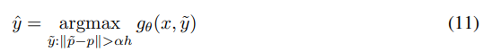

其中p是对应于向量y的argmax值的热图上的像素坐标。我们用更新规则$\epsilon\cdot \frac{\nabla _x}{||\nabla_x||}$，迭代更新优化直到收敛，其中$\nabla _x$是和输入有关的梯度，$\epsilon=0.1$。

表1顶部给出了与基于最小化训练损失（本例中为MSE）的类似攻击的经验比较。我们对MPII数据集[3]的验证子集进行评估，该数据集由3000张图像组成，定义如[26]所示。我们评估感知扰动的程度，其中感知度表示为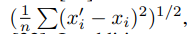，其中x和x'为原始图像和扭曲图像，n为像素数[32]。此外，我们还报告了结构相似性指数（SSIM）[36]，已知该指数与人类对图像结构的视觉感知密切相关。如表1所示，与使用训练代理（MSE)生成的对抗性示例相比，使用Houdini生成的对抗性示例与合法示例更为相似。对于优化为收敛的非目标攻击，使用Houdini生成的扰动比使用MSE生成的扰动可感知性低50%

根据使用的损失函数，我们测量了完全破坏姿势估计系统（PCKh=0）所需的迭代次数。收敛如图2所示

---

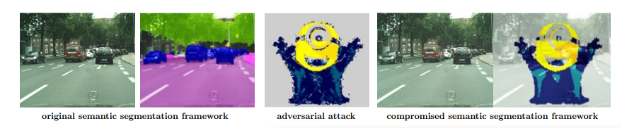

图1：我们使网络生成一个minion，作为原始图像的敌对扰动版本的分割。请注意，原始图像和受干扰的图像无法区分。

图2：姿势估计攻击的收敛动力学：（a）扰动感知与nb。迭代（b）PCKh0。5对nb。迭代，（c）重新定位的关节与感知能力的比例

---

结果表明，在多次迭代（100次）后，在给定目标指标的情况下，使用Houdini可以完全降低网络性能。

当使用训练代理（MSE）生成对抗性示例时，即使在优化过程迭代300次之后，我们也无法在攻击上达到类似的成功水平。**这一观察结果强调了损失函数在结构化预测问题中用于生成对抗性示例的重要性**。我们在图3中展示了一个示例。有趣的是，被破坏的图像的预测姿势仍然能给人留下一个总体上合理的印象，同时完全无法通过正式评估。事实上，受损网络所犯的错误看起来很自然，并且是姿势估计框架的典型错误：定位不精确、左右肢体混淆、多人关节合并等。

---

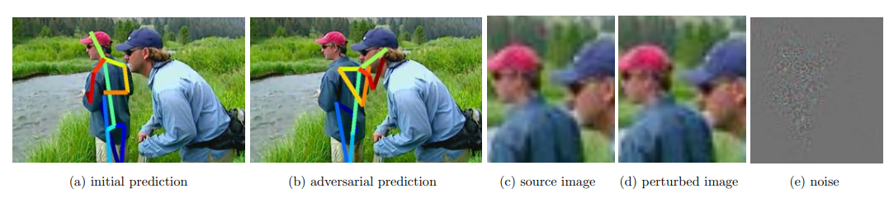

图3：利用Houdini损失的对抗性攻击导致姿势估计中断的示例：经过55次迭代后，PCKh0。5从81.25降至0.00（最终扰动感知度为0.0063）。

在第二个实验中，我们以姿势转移的形式执行有针对性的攻击，也就是说，我们强迫网络产生对任意姿势（与之前一样，在给定目标度量PCKh0.5的情况下定义了成功）。实验设置如下：对于给定的一对图像（i，j），当输入为图像j时，我们强制网络输出图像i的地面真实姿态，反之亦然。这项任务更具挑战性，取决于原始姿势和目标姿势之间的相似性。令人惊讶的是，即使两种地面真相姿态非常不同，有针对性的攻击仍然是可行的。图4显示了一个示例，其中模型预测了描绘站立的人（反之亦然）的不利扰动图像中人体处于水平位置的姿势。图4还显示了一个类似的实验，两个人分别站着和坐着。

## 5. 语义分割

语义分割使用另一个定制的度量来评估性能，即联合上的平均交集（mIoU）度量，定义为对IoU=TP/（TP+FP+FN）的类进行平均，其中TP、FP和FN分别代表真阳性、假阳性和假阴性，分别适用于每个类。与对高度不平衡的数据集过于乐观的每像素精度和对非背景类错误警报惩罚不足的每类精度相比，该指标有利于通过更严格的遮罩（实例分割）或边界框（检测）进行准确的对象定位。根据任务公式，使用每像素softmax或多类交叉熵损失对模型进行训练，即优化为平均每像素或每类精度，而不是mIoU。在这类应用中，对抗性攻击的主要目标是自动驾驶汽车和机器人。Xie等人[37]曾在语义分割的背景下探讨过对抗性攻击。然而，他们利用了用于训练网络的同一个代理。我们进行了Sec 4形容的一系列的实验，也就是说，我们在语义分割模型上展示了有针对性和无针对性的攻击。我们使用预先训练好的Dillact10模型进行语义分割[38]，并评估对Cityscapes数据集验证子集的攻击是否成功[8]。在第一个实验中，我们直接改变给定测试图像中的目标mIoU度量，通过目标攻击和非目标攻击。如表2所示，Houdini至少可以和（NLL）代理损失一样能愚弄模型，同时使用一个不易察觉的扰动。事实上，与NLL产生的噪声相比，基于胡迪尼的对抗性扰动使模型的性能改变50%，其显著性降低约30%。

---

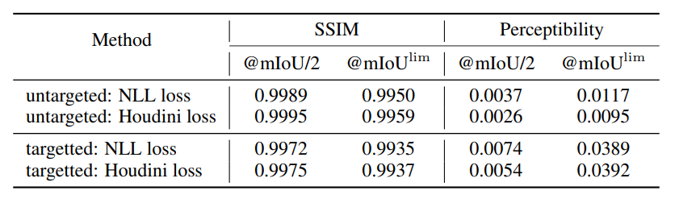

表2：语义切分：切分系统中有针对性攻击和无针对性攻击的经验性能比较。根据目标指标，mIoU/2表示50%的性能下降，而mIoUlim对应于300次迭代后的收敛或终止。SSIM：越高越好，可感知性：越低越好。基于胡迪尼的攻击不那么明显。

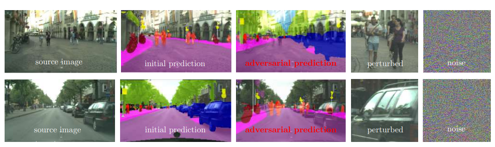

图5：针对语义分割系统的目标攻击：在Cityscapes数据集中的两幅图像之间切换目标分割[8]。最后两列分别放大了受干扰图像的部分和添加到原始图像上的对抗性干扰。

---

第二组实验包括有针对性的攻击。也就是说，改变输入图像以获得任意目标分割图作为网络响应。在图5中，我们展示了一个在分割传输设置中的此类攻击的实例，即目标分割是不同图像的地面真实分割。很明显，这种类型的攻击仍然是可行的，只要有一点对抗性的干扰（即使在放大图片之后）。图5描述了一个更具挑战性的场景，其中目标分割是一个任意地图（例如一个仆从）。同样，我们可以通过添加一个几乎不明显的扰动，让网络产生我们选择的分割。

## 6 语音识别

我们评估了Houdini对自动语音识别（ASR）系统的对抗性攻击的有效性。传统上，ASR系统由不同的组件组成（例如，声学模型、语言模型、发音模型等），每个组件分别进行训练。最近，ASR研究的重点是基于深度学习的端到端模型。这些类型的模型得到一个语音片段作为输入，并输出一个转录本，而无需额外的后处理。

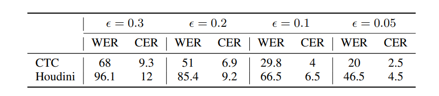

图6:CTC和Houdini生成的对抗性示例的CER和WER单位（%）。

---

在这项工作中，我们使用了一个深度神经网络作为我们的模型，其结构类似于[2]中提出的模型。该系统由两个卷积层、七层双向LSTM[17]和一个全连接层组成。我们优化了专门为ASR系统设计的连接主义时间分类（CTC）损失函数[13]。该模型获取原始光谱图作为输入（使用25ms的窗口大小、10ms的帧大小和汉明窗口提取），并输出转录本。

......

## 7 总结

我们引入了一种新的方法来生成针对感兴趣任务特有的性能度量定制的对抗性示例。我们已经将Houdini应用于具有挑战性的结构化预测问题，如姿势估计、语义分割和语音识别。在每一种情况下，胡迪尼都允许用不可察觉的干扰来愚弄最先进的学习系统，从而将对抗性示例的使用扩展到图像分类任务之外。眼睛所见，耳朵所听，心灵所信。（哈里·胡迪尼）

