## 摘要

本文通过开发两种新的攻击方法，实现了高性能图像分类器的目标欺骗。第一种方法为目标类生成通用的扰动，第二种方法生成特定于图像的扰动。在MNIST和CIFAR10数据集上进行了大量实验，以深入了解所提出的算法并证明其有效性。

## 1 简介

最近，人们有兴趣通过生成对抗性示例来“破坏”神经网络，这会导致经过训练的网络错误分类。这是一个重要的研究方向，因为它有助于在发起恶意攻击之前识别系统中的漏洞。对抗性样本也有助于生成更多不同的训练数据，这使得深度分类器更加健壮[2] [6]

...

本文提出了两种算法来解决等式1中的定向攻击问题，这两种算法通过以下方式愚弄分类器：1）学习通用扰动以转向精确目标（翻转）；2）使用对抗网络生成恶意图像（ANGRI）来扭曲图像。

## 2 相关工作

开发用于愚弄深层神经网络的图像扰动算法对于生成更有效的训练样本和在训练模型中发现缺陷非常有用[1]。这些算法可根据以下标准进行划分：

1. 输入图像的相干性：证明深卷积神经网络（DCNN）弱点的最流行作品之一是[13]。作者使用遗传算法生成对人类观察者没有语义意义的图像，但这可以使深度CNN分类器以高置信度预测类别。然而，由于该模型生成语义不连贯的图像，人类很容易将其识别为敌对图像。下一类算法通过添加视觉上不易察觉的残差来变换图像，如[1]、[2]、[11]、[16]、[10]。这些算法生成的篡改图像在视觉上与输入图像匹配，但仍然愚弄了分类器。与后面的算法类似，本文提出的方法也会生成与输入图像视觉相似的扰动图像
2. 受害者访问：在[2]、[16]、[15]、[12]等中，对抗算法需要了解受害者模型（白盒）的内部结构，而[1]、[14]、[7]、[11]和[9]是黑盒攻击模型。我们所提出的方法能够发起黑盒攻击。
3. 跨模型泛化：文献[15]、[12]中的算法针对一个特定的分类器，而文献[13]、[11]、[17]、[16]和[9]中的方法则泛化到其他没有经过训练的分类器。本文描述的方法可推广到具有相似结构的分类器。
4. 模式普遍性：大多数算法对不同的输入产生不同的扰动，但[11]只产生一个扰动，这通常会导致不正确的分类。本文中的一种方法产生了对每一类都通用的扰动。
5. 有目标的欺骗：算法（如11）考虑了“愚弄”的弱版本，因为它足以使分类器错误分类。然而[1]、[15]、[10]、[4]解决了一个更难的问题，即分类器必须预测特定的目标类；本文提出的两种方法属于后者。
6. 多个受害者：一些方案，如[1]和这里描述的方法，可以通过同时针对多个受害者分类器进行明确的训练，将它们一起瞄准，而其他方案，如[14]、[11]、[13]等，一次只能瞄准一个。

## 3 提出的算法

在这项工作中，给定一个输入图像、一个目标类和一个预先训练好的分类器，目标是生成一个看起来与输入相似的图像，但通过使其预测目标类作为输出来愚弄分类器，如等式1所示。在本节中，针对“有针对性的愚弄”提出了两种黑匣子攻击算法，UPSET和ANGRI。

### 3.1 UPSET：转向精确目标的普遍扰动

在n分类的设定中，UPSET试图产生n个普适摄动$r_j, j\in \{1,2,...,n\}$，这样当rj被添加到任何不属于j类的图像中时，分类器将把结果图像分类为来自j类的图像。UPSET的主要工作是残差生成网络R，它以目标类t作为输入，并生成与输入图像x维数相同的扰动rt=R（t）。敌对图像$\hat x$

生成。其中U表示UPSET网络。x中的像素值被标准化为[−1, 1]. 网络R也产生范围内的值[−1, 1]. R的输出乘以比例因子s，如等式3所示。设置s=2确保s×R（t）能够转换输入空间[−1，1]中的任何值。[−1，1]中的任何值当添加到x时。但是可以选择较低的s值，这限制了每个像素处的最大可能残值。加法后，输出在[−（s+1），s+1]。它被夹在[−1，1]生成有效图像。该对抗性图像生成过程如图1a所示。

---

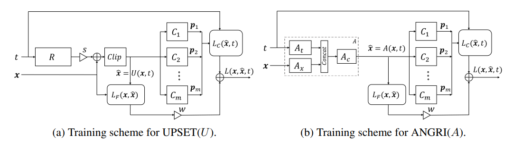

图1：生成对抗图像的训练网络。x是输入图像，t是目标类，$\hat x$是输出对抗图像（注意UPSET的x没有进入网络）

### 3.2 ANGRI：用于生成流氓图像的对抗网络

ANGRI获取一个属于$c_x$类的输入图像x和一个目标类$t\neq c_x$，并将其转换为一个新图像ˆx，这样分类器就会错误地将其标记为来自t类的对象。与UPSET相比，ANGRI不会产生普遍扰动，因为其输出取决于输入图像。变换后的图像是ˆx=A（x，t），**其中A表示ANGRI网络**。

### 3.3损失函数

给定**m个预训练分类器**$C_i$，用pi表示它们对敌对图像ˆx的输出分类概率，即pi=Ci（ˆx）。然后，对于UPSET 和ANGRI，损失的定义见等式4

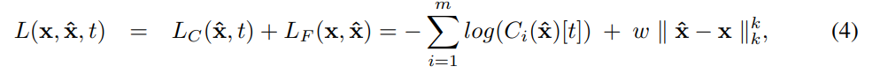

其中，LC表示（错误）分类损失，LF表示保真度损失。LC是一种分类交叉熵损失，如果分类器不能预测目标类别t，则会惩罚生成器网络，而LF是x和ˆx之间差异的范数，这确保了输入和输出图像看起来相似。

权重w用于在生成的对抗性示例的逼真度和愚弄能力之间进行权衡。

k的选择应确保其不会促进稀疏性，否则残量将在小区域内累积，并且会很明显。使用k=2就足够了，即L2范数。在UPSET的情况下，由于网络已经产生残差，等式4中的第二项被$||R(x,t)||_2^2$取代。两个系统的训练方案以及相关损失如图1所示

两个系统的训练方案以及相关损失如图1所示。

## 4 实验结果

以下四个指标用于评估拟议愚弄网络的性能：

1. 目标愚弄率（TFR）：等式1定义的事件发生率（较高表示分类器容易被愚弄）
2. 错误分类率（MR）：由公式2定义的事件发生率（更高意味着分类器容易被愚弄）
3. 保真度分数（FS）：**每个通道每像素的平均残差范数（较低表示残差不太明显）**。
4. 置信度（C）：目标类被成功愚弄的**平均概率**。这显示了分类器被愚弄时的可信度。（越高意味着对错误的课程越有信心）

使用多个分类器进行训练被称为“同时”训练。如果UPSET或ANGRI在同一组分类器上进行训练和测试，则称为“自我”攻击，否则称为“交叉”攻击。结果在两个数据集MNIST[8]和CIFAR-10[5]中进行了描述

### 4.1网络架构

本节描述了MNIST和CIFAR-10数据集的分类器、UPSET和ANGRI模型的网络架构。使用以下符号定义网络：

1. 激活功能：除最后一层使用softmax（S）或tanh（T）激活功能外，任何地方都使用ReLU（R）或泄漏ReLU（L）
2. 调节：Dφ表示dropout 为φ，B表示Batch标准化
3. 身份：身份层（即身份层）不表示正则化或激活。
4. 卷积层：$C_{µ，ν，ζ，β，γ}$表示卷积层，其内核大小为µ×µ，步长为ζ，后跟正则化β和激活函数γ。
5. 反卷积层：$DC_{µ，ν，ζ，γ}$表示一个反褶积层，其内核大小为µ×µ，步长为ζ，后跟激活函数γ
6. 稠密：Fλ，γ表示一个完全连接的层，其λ节点后跟激活函数γ
7. 池层：$M_{l,ζ}$表示$l\times l$，步长为ζ的最大池层，a表示平均池层
8. 块：Rγ是一个残差块，类似于[3]中定义的包含正则化γ的块。

#### 4.1.1 MNIST

对于MNIST实验，训练了三个分类器网络M1、M2和M3。M1是一个具有两个卷积层和两个稠密层的网络。M2与M1类似，但参数更多。M3是一个三层密集网络。对分类器网络的结构进行了分析

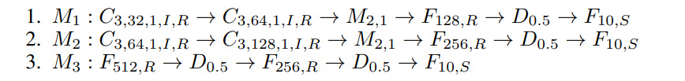

**另外一个与M1结构完全相同的M4型号**，在输入MNIST数字图像中使用附加噪声以及旋转（±10度）和移位（沿两个轴移动20%）进行训练。四个模型的初始测试集准确率分别为99.11%、99.23%、97.39%和98.03%。所有分类器都针对12个epoch进行了训练，以下章节中描述的所有UPSET和ANGRI模型都针对25个epoch进行了训练。

UPSET网络的参量发生器R（图1a）由六个致密层组成，如下所示：

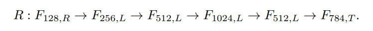

对于ANGRI，10-D目标的基本网络At、784-D输入图像的基本网络Ax和顶部网络Ac（如图1b所示）定义为：

#### 4.1.2 CIFAR-10

四个分类器，C1− C4是经过训练的。C1和C2是resnet类型的网络，而C3和C4分别是具有9层和4层卷积的深卷积网络。四个分类器的初始测试集精度C1−C4分别为86.65%、86.58%、86.86%和87.09%。网络如下所示：

CIFAR-10的UPSET网络R（图1a）是一个具有6个反褶积层的网络，后面是6个卷积层，定义如下：

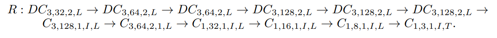

CIFAR-10的ANGRI网络有3个部分，如图1b所示。At网络和Ax网络都有3个反褶积层，前者以一个10维单热点目标向量为输入，后者以一个3×32×32的图像为输入。At和Ax合并后的Ac网络有3个反褶积，然后是6个卷积层。具体结构总结如下：

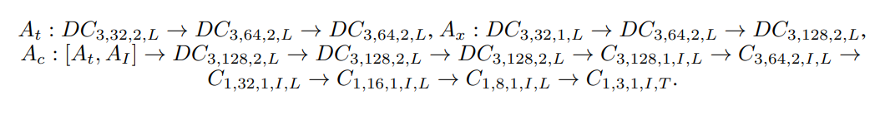

### 4.2 样本图像和残量

图2显示了MNIST的一些成功对抗图像示例，使用w=0.1表示ANGRI，w=0.06，s=2表示UPSET。图3a显示了每个目标类别的成功攻击率。显然，目标0和1很难生成残量。反映这一事实，在图3b中可以看出，随着w的增加，UPSET停止产生0级和1级的残差。随着w的增加，扰动被迫增加较小的残差。因此，它放弃了这些困难的目标，并将其视觉损失预算保留给它可以成功愚弄的类别。

---

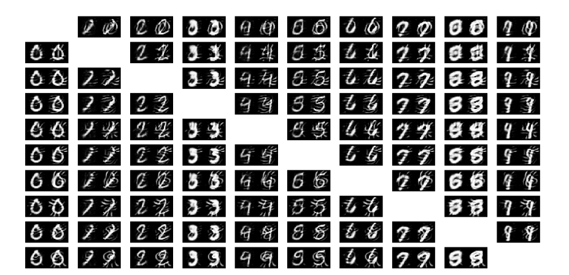

图2:MNIST中的对抗性图像样本。每列表示输入类0到9，而每行表示目标类0到9。每个单元格中的左侧图像是使用ANGRI（w=0.1）生成的，而右侧图像是从UPSET（w=0.06）生成的。

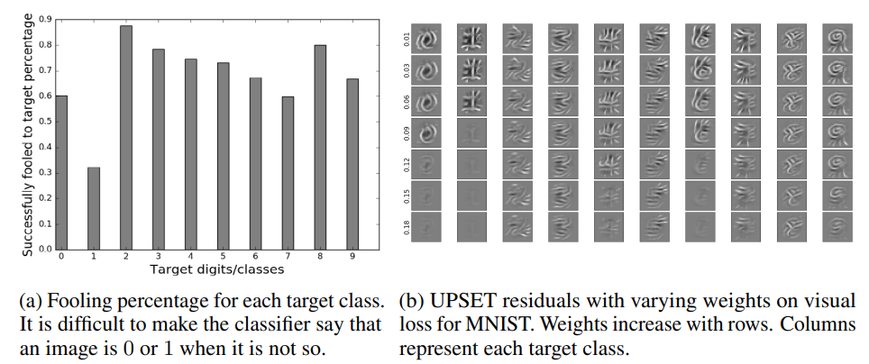

图3 Analysis of UPSET (w = 0.06, s = 2) for MNIST.

---

图4显示了CIFAR-10中每个输入和目标类的UPSET和ANGRI的一些示例输出。在图5中可以清楚地看到ANGRI和UPSET的扰动幅度之间的差异。此外，在图5b中，残差具有更多变化，因为ANGRI产生特定于图像的失真，而不是产生独立于输入图像的特定于目标的扰动的扰动。因此，如图4所示，与UPSET相比，ANGRI能够产生更多视觉上不明显的失真。

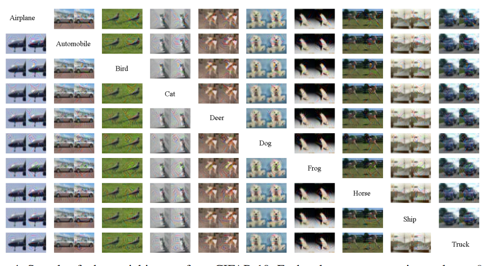

图4：来自CIFAR-10的对抗性图像样本。每列表示输入类0到9，而每行表示目标类0到9。每个单元格中的左侧图像是使用ANGRI（w=0.11）生成的，而右侧图像是从UPSET（w=0.08）生成的。因此，第4行第7列中的图像看起来像青蛙，但被归类为猫。（最好通过电子方式查看）

### 4.3 视觉loss权重的效果

在MNIST上研究了不同视觉loss权重w的影响。它在0.01到0.2之间变化，步长为0.01。考虑了两种情况，一种是使用分类器M1，另一种是使用分类器M4。请注意，两个分类器具有相同的体系结构，但M4使用第4.1.1节所述的增强数据进行训练。图6a显示，正如预期的那样，愚弄率随着保真度分数的增加而降低，也就是说，通过向被打乱的图像添加具有更高幅度的残差，ANGRI能够更好地愚弄。图6b显示，随着视觉损失重量的增加，欺骗率下降，因为网络现在被迫添加较小的残差来破坏输入图像。在图6中的两幅图像中，MR大于TFR，因为有针对性的愚弄比错误分类更严重。对于TFR较高的区域（大于约60%），ANGRI产生的残差比UPSET低。此外，愚弄M4比愚弄M1更困难，这意味着在训练数据中有噪声有助于使分类器更健壮地抵抗干扰或ANGRI。然而，如图6a所示，ANGRI仅显示M4的性能略有下降，这与UPSET不同。

---

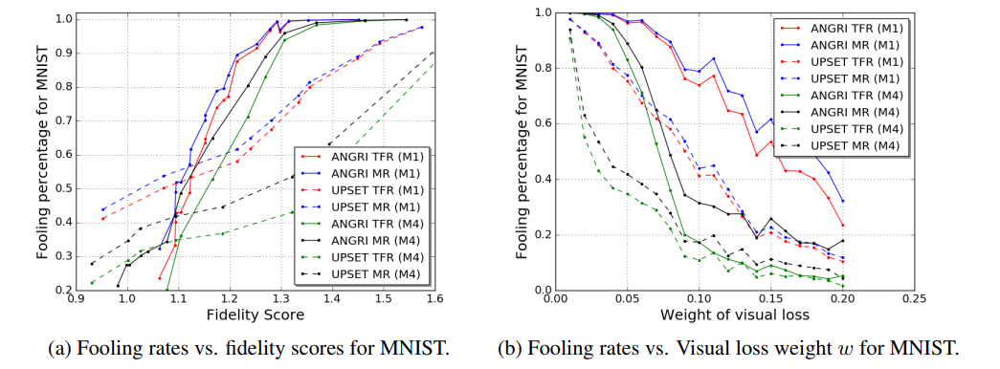

图6：生成对抗图像的训练网络。增加w会降低目标愚弄率（TF）和误分类率（MR）。TFR总是低于MR. ANGRI给出的相同w的TFR高于UPSET。

---

### 4.3.1同步训练和跨模型综合

在本实验中，UPSET模型的训练值为s=2和w=0.06，而ANGRI模型的训练值为w=0.1。当攻击不同的分类器时，通过考虑它们的TFR来研究所提出方法的可推广性。由于网络结构可能对可归纳性有很大影响，因此需要训练不同类别的分类器。在MNIST中有两个卷积网络，M1和M2，以及一个密集网络M3。在CIFAR-10中，有两个resnet类型的网络C1和C2，以及两个卷积网络C3和C4

表1总结了MNIST的自我（训练并测试Ci）和交叉（训练并测试Cj，I6=j）攻击的结果。对于CIFAR-10，表2报告了使用单个分类器训练的UPSET和ANGRI模型的自攻击和交叉攻击TFR，而表3显示了使用两个分类器同时训练的性能。表中的一些关键观察结果如下：

---

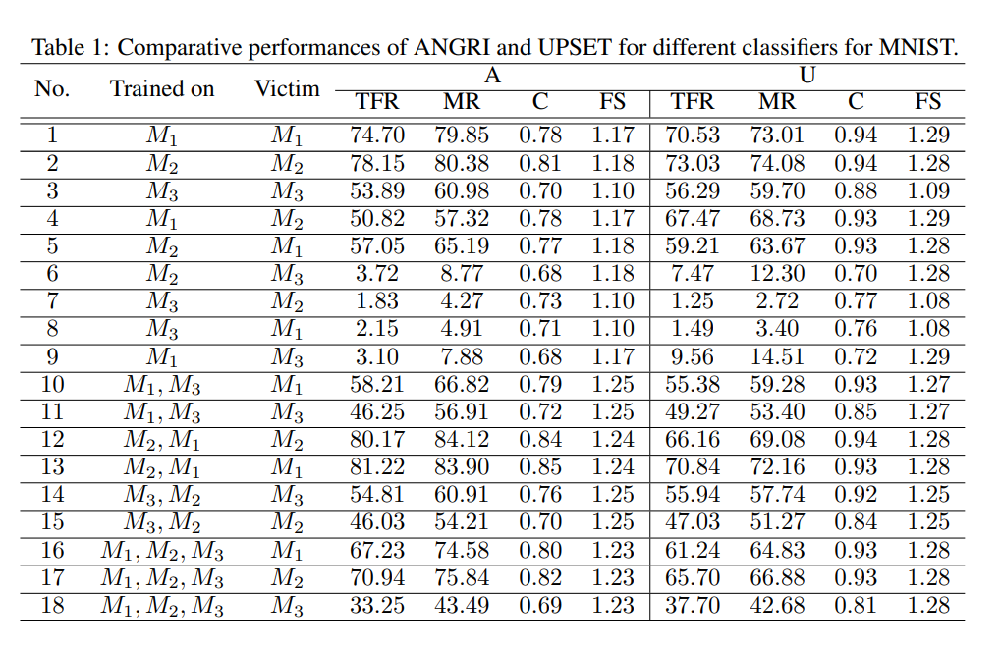

表2：在单个分类器上进行训练时，ANGRI和UPSET在CIFAR-10上的TFR性能比较。每个单元格表示（第一个元素）TFR和（第二个元素）TFR和ANGRI。C1和C2都是resnet类型，而C3和C4是卷积网络。如粗体数字所示，**如果愚弄网络针对的是结构相似的网络，那么它们的泛化效果会更好**。

表3：在2个分类器上进行训练时，ANGRI和UPSET在CIFAR-10上的TFR性能比较。每个单元格表示（第一个元素）的愚弄率和（第二个元素）的愚弄率

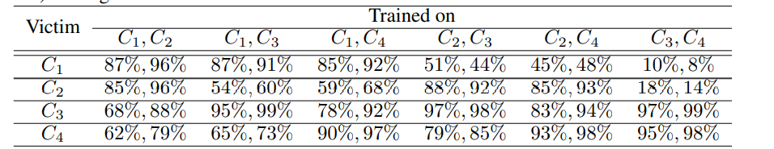

---

1. 交叉攻击愚弄率低于自攻率。
2. 使用特定结构的分类器（convolutional/resnet/dense）训练的UPSET和ANGRI模型能够比不同结构的分类器更好地愚弄其他类似结构的分类器。使用resnet风格的分类器训练的UPSET和ANGRI模型似乎可以很好地推广到CIFAR-10中的其他结构。然而，当对非resnet结构的分类器进行训练时，这两种方法都无法愚弄其他类型的分类器。
3. 用多个分类器一起训练UPSET或ANGRI有助于他们更好地概括。在比较表2和表3中的TFR时，可以清楚地看到这一点。让Ci，Cj→ Ck是指两者都接受Ci和Cj训练，然后用来攻击Ck。在几乎所有情况下，Ci、Cj→ Ck的愚弄率比Ci→ Ck或Cj→ Ck都高。这种从同时训练中获得的概括，成本很小，因为与单独训练时相比，自攻的表现略有下降。
4. 如表1所示，当分类器被愚弄时，它的置信度C很高。

本文提出了两种新的目标网络欺骗方法，即UPSET和ANGRI。**UPSET仅从输入端的目标类信息为每个类生成一个扰动，因此扰动对每个目标类都是通用的**。由于只需添加和剪辑即可生成对抗性图像，因此在推断过程中，**UPSET非常快**。另一方面，ANGRI可以访问输入图像，因此在类似的视觉逼真度水平下，它可以生成比UPSET更好的对抗性图像。ANGRI在分类器也使用噪声图像进行训练时也表现良好，而UPSET的愚弄能力会降低。与[1]不同的是，多个目标需要多个网络，UPSET和ANGRI都是单一网络，可以生成有针对性的敌对图像，但可以同时在多个分类网络上进行训练，使它们能够更好地概括并同时针对多个系统。**这两种方法都是黑盒模型，即它们不需要了解受害者系统的内部情况。**